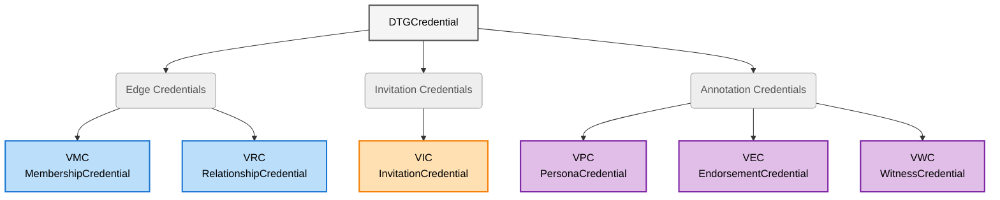

## DTG Credential Taxonomy

*This section is informative.*

This section provides a visual overview of the DTG Core Credential types and their formal type hierarchy. The three functional categories (edge, invitation, annotation) are descriptive aids only; they do not appear in credential schemas.



### Formal W3C Type Hierarchy

```text
VerifiableCredential
└── DTGCredential
    ├── MembershipCredential (VMC)
    ├── RelationshipCredential (VRC)
    ├── InvitationCredential (VIC)
    ├── PersonaCredential (VPC)
    ├── EndorsementCredential (VEC)
    └── WitnessCredential (VWC)
```

> **Note:** The [[ref: r-card]] (relationship card) that appeared in earlier drafts of this specification is a [[ref: verifiable data structure]] (VDS), not a `DTGCredential` subtype. It will be defined in the planned **DTG Verifiable Data Structures** specification (see [Related Specifications](#related-specifications)).

## W3C Verifiable Credentials Version Support

This section is normative.

### Primary Standard: v2.0

This specification is written using **W3C Verifiable Credentials Data Model v2.0** syntax. All DTG implementations MUST support v2.0 credential verification and SHOULD support v2.0 credential issuance.

### Legacy System Compatibility: v1.1

Many existing [[ref: identity verification providers]] (IDVPs), [trust registries](https://glossary.trustoverip.org/#term:trust-registry), and community infrastructure may only support W3C VC Data Model v1.1. To ensure broad interoperability and avoid forcing costly system migrations:

- DTG implementations SHOULD accept and verify v1.1 credentials
- Existing credential issuers MAY issue DTG-compliant credentials using v1.1 syntax
- New implementations SHOULD prioritize v2.0 but MAY also issue v1.1 when required by ecosystem constraints

> **Design Intent:** This dual-version support enables:
>
> - Legacy IDVPs to issue [[ref: IDVCs]] (identity verification credentials) without system upgrades
> - Existing [[ref: VTCs]] to participate in the DTG using their current infrastructure
> - Gradual ecosystem migration from v1.1 to v2.0 without breaking trust relationships

### Property Mapping

The only differences between v1.1 and v2.0 DTG credentials are:

| Property | v1.1 | v2.0 |
| ---------- | ------ | ------ |
| **Context** | `https://www.w3.org/2018/credentials/v1` | `https://www.w3.org/ns/credentials/v2` |
| **Issuance** | `issuanceDate` | `validFrom` |
| **Expiration** | `expirationDate` | `validUntil` |

All DTG-specific schemas (types, issuer requirements, credentialSubject structure) are identical.

> **Implementation Note:** Verifiers supporting both v1.1 and v2.0 credentials MUST be able to process proof types commonly used in both versions. Issuers SHOULD use well-supported proof types and include all necessary contexts.

### Dual-Version Examples

**v2.0 (Primary):**

```json
{
  "@context": [
    "https://www.w3.org/ns/credentials/v2",
    "https://firstperson.network/credentials/dtg/v1",
    "https://w3id.org/security/suites/ed25519-2020/v1"
  ],
  "type": ["VerifiableCredential", "DTGCredential", "MembershipCredential"],
  "issuer": "did:web:chess-club.example",
  "validFrom": "2026-01-06T10:00:00Z",
  "validUntil": "2027-01-06T10:00:00Z",
  "credentialSubject": {
    "id": "did:key:z6MkpTHR8VNs..."
  },
  "proof": {
    "type": "Ed25519Signature2020",
    "created": "2026-01-06T10:00:00Z",
    "proofPurpose": "assertionMethod",
    "verificationMethod": "did:web:chess-club.example#key-1",
    "proofValue": "z3FXQjecWJKT..."
  }
}
```

**v1.1 (Legacy Compatibility):**

```json
{
  "@context": [
    "https://www.w3.org/2018/credentials/v1",
    "https://firstperson.network/credentials/dtg/v1",
    "https://w3id.org/security/suites/ed25519-2020/v1"
  ],
  "type": ["VerifiableCredential", "DTGCredential", "MembershipCredential"],
  "issuer": "did:web:chess-club.example",
  "issuanceDate": "2026-01-06T10:00:00Z",
  "expirationDate": "2027-01-06T10:00:00Z",
  "credentialSubject": {
    "id": "did:key:z6MkpTHR8VNs..."
  },
  "proof": {
    "type": "Ed25519Signature2020",
    "created": "2026-01-06T10:00:00Z",
    "proofPurpose": "assertionMethod",
    "verificationMethod": "did:web:chess-club.example#key-1",
    "proofValue": "z3FXQjecWJKT..."
  }
}
```

> **Note:** All examples in this specification use v2.0 syntax unless explicitly labeled otherwise. When implementing v1.1 support, use the property mappings above.

## Base Structure

This section is normative.

All DTG credentials share this W3C VC structure (v2.0 shown; see [Legacy System Compatibility](#legacy-system-compatibility-v11) for v1.1 compatibility):

**Schema:**

- `@context` (array, REQUIRED): MUST include `"https://www.w3.org/ns/credentials/v2"` and `"https://firstperson.network/credentials/dtg/v1"`, plus any additional contexts required by the proof type
- `type` (array, REQUIRED): MUST include `"VerifiableCredential"`, `"DTGCredential"`, and exactly one concrete subtype
- `issuer` (string, REQUIRED): DID of the issuing entity ([[ref: C-DID]], [[ref: M-DID]], [[ref: R-DID]], or [[ref: P-DID]] as appropriate)
- `validFrom` (string, REQUIRED): ISO 8601 datetime (`issuanceDate` in v1.1)
- `validUntil` (string, OPTIONAL): ISO 8601 datetime (`expirationDate` in v1.1)
- `credentialSubject` (object, REQUIRED):
  - `id` (string, REQUIRED): DID of the subject
  - Additional type-specific properties
- `taskContext` (string, OPTIONAL unless a credential type requires it): identifier (`threadId`) of the [trust task](https://glossary.trustoverip.org/#term:trust-tasks) exchange in which this credential was issued. See [Trust Task Context Binding](#trust-task-context-binding).
- `proof` (object, REQUIRED): W3C VC proof object

**Example:**

```json
{
  "@context": [
    "https://www.w3.org/ns/credentials/v2",
    "https://firstperson.network/credentials/dtg/v1",
    "https://w3id.org/security/suites/ed25519-2020/v1"
  ],
  "type": ["VerifiableCredential", "DTGCredential", "MembershipCredential"],
  "issuer": "did:example:vtcCommunityDid",
  "validFrom": "2026-01-06T10:00:00Z",
  "validUntil": "2027-01-06T10:00:00Z",
  "credentialSubject": {
    "id": "did:example:memberMdid"
  },
  "proof": {
    "type": "Ed25519Signature2020",
    "created": "2026-01-06T10:00:00Z",
    "proofPurpose": "assertionMethod",
    "verificationMethod": "did:example:vtcCommunityDid#key-1",
    "proofValue": "z3FXQjecWJKT..."
  }
}
```

## Edge Credentials

This section is normative.

Edge credentials establish relationships between existing entities (nodes) in the DTG: [[ref: VRCs]] attest to relationships between two entities, and [[ref: VMCs]] attest to community membership. In both cases, a bi-directional pair of credentials forms a complete [[ref: DTG edge]].

### VRC (Verifiable Relationship Credential)

**Purpose:** Attests to a relationship between two entities; two VRCs (one each direction) form a complete [[ref: DTG edge]].

**Schema:**

- `type` (array, REQUIRED): MUST include `"RelationshipCredential"`
- `issuer` (string, REQUIRED): [[ref: R-DID]] or [[ref: M-DID]] of the source party
- `credentialSubject` (object, REQUIRED):
  - `id` (string, REQUIRED): R-DID or M-DID of the target party

**Example:**

```json
{
  "@context": [
    "https://www.w3.org/ns/credentials/v2",
    "https://firstperson.network/credentials/dtg/v1",
    "https://w3id.org/security/suites/ed25519-2020/v1"
  ],
  "type": ["VerifiableCredential", "DTGCredential", "RelationshipCredential"],
  "issuer": "did:peer:2.Ez6LSbysKZ...",
  "validFrom": "2026-01-06T10:00:00Z",
  "credentialSubject": {
    "id": "did:peer:2.Ez6LSpSrLxn..."
  },
  "proof": { "//": "..." }
}
```

**Note:** R-DIDs are RECOMMENDED for privacy; M-DIDs are allowed for bootstrapping (see [Privacy Considerations](#privacy-considerations)).

#### Unilateral Relationship Identification

A [[ref: relationship DID]] (R-DID) generated by a controller for the explicit purpose of establishing a VRC serves as a globally unique identifier for that relationship edge from the perspective of the controller.

Therefore, a relationship within the DTG can be canonically identified by two independent identifiers:

- The Source R-DID (controlled by the Issuer)
- The Target R-DID (controlled by the Subject)

Semantic statements, metadata, or private context regarding the relationship MAY be anchored solely to the controller's own R-DID, without requiring the resolution or inclusion of the counterparty's identifier.

> **IMPORTANT**: The valid application of this specification requires that each entity MUST generate a new, unique R-DID for every single entity they connect with, even within the same community.

#### Pairwise Zero-Knowledge Proof

The holder of a VRC MAY construct a zero-knowledge proof that demonstrates possession of a valid VRC and selectively discloses chosen attributes, subject DIDs, or predicates over them. A common application is to disclose the parties' [[ref: P-DIDs]] (persona DIDs) while hiding the underlying [[ref: R-DIDs]] (relationship DIDs), enabling a public, verifiable claim that two known [[ref: personas]] have a relationship without exposing the private pairwise channel between them or enabling correlation across the holder's other presentations. This construction is available to any two parties who hold a VRC between them, regardless of whether they share membership in a [[ref: VTC]]. It supports selective disclosure and minimal correlation across contexts. It does not by itself confer any community-level assurance (e.g., personhood); whatever assurance it carries derives from the parties' own out-of-band context, the public reputation attached to any disclosed persona DIDs, and the cryptographic integrity of the VRC.

### VMC (Verifiable Membership Credential)

**Purpose:** Attests to the membership of an entity in a [[ref: VTC]] or [[ref: VTN]]; two VMCs (one each direction) form a complete [[ref: DTG edge]].

**Schema:**

- `type` (array, REQUIRED): MUST include `"MembershipCredential"`
- `issuer` (string, REQUIRED): [[ref: C-DID]] of the VTC or VTN
- `credentialSubject` (object, REQUIRED):
  - `id` (string, REQUIRED): [[ref: M-DID]] of the member (person/device/agent) OR C-DID (for VTN-to-VTC membership)

**Example:**

```json
{
  "@context": [
    "https://www.w3.org/ns/credentials/v2",
    "https://firstperson.network/credentials/dtg/v1",
    "https://w3id.org/security/suites/ed25519-2020/v1"
  ],
  "type": ["VerifiableCredential", "DTGCredential", "MembershipCredential"],
  "issuer": "did:web:chess-club.example",
  "validFrom": "2026-01-06T10:00:00Z",
  "credentialSubject": {
    "id": "did:key:z6MkpTHR8VNs..."
  },
  "proof": { "//": "..." }
}
```

#### Community-Anchored Zero-Knowledge Proof

A VRC is a signed verifiable credential. It MAY be presented and verified using standard W3C VC presentation methods when privacy preservation is not required, and it SHOULD be presented using a zero-knowledge proof whenever privacy preservation is desired. Community membership is **not** a precondition for issuing, holding, or presenting a VRC; two entities that do not share (or do not hold) a [[ref: VMC]] can still exchange VRCs, and the resulting edges are valid trust attestations standing on their cryptographic signatures and on whatever real-world context the parties bring to them.

When both parties to a VRC hold VMCs from the same community, the holder MAY construct a community-anchored ZKP of the relationship. In such a proof, the holder demonstrates:

1. Possession of the VRC
2. Possession of the underlying VMC (proving membership in the community)
3. The VRC issuer possesses a VMC from the *same* [[ref: C-DID]] (community DID)

This allows the relationship's existence to be proven within a shared community's governance context without revealing the specific DIDs or other credential details. Whatever assurances the community's trust registry attaches to its VMCs (e.g., personhood, when the VMCs qualify as [[ref: PHCs]]) carry forward into the proof.

This is one proof construction available to relationships within a shared community. Detailed ZK protocols and registry-ZK interactions are out of scope for this specification (see [Zero-Knowledge and Selective Disclosure](#zero-knowledge-and-selective-disclosure)).

**Note:** Implementations SHOULD make ZKP presentation the default behavior so that users obtain privacy preservation without having to opt in. See [Privacy Considerations](#privacy-considerations).

## Invitation Credentials

This section is normative.

### VIC (Verifiable Invitation Credential)

**Purpose:** Authorizes a prospective member to join a [[ref: VTC]] or [[ref: VTN]] when presented to the [[ref: VTA]]/[[ref: PEP]]. The [[ref: DTG invitation credential]] has two functional variants distinguished by issuer and subject rules (not by separate type strings): the [[ref: VTC invitation credential]] and the [[ref: VTN invitation credential]].

**Schema:**

- `type` (array, REQUIRED): MUST include `"InvitationCredential"`
- `issuer` (string, REQUIRED):
  - For VTC invitation: VTC [[ref: C-DID]] OR authorized member's [[ref: M-DID]] (per policy)
  - For VTN invitation: VTN C-DID OR member VTC's C-DID (per policy)
- `credentialSubject` (object, REQUIRED):
  - `id` (string, REQUIRED):
    - For VTC invitation: prospective member's M-DID OR prospective VTC's C-DID
    - For VTN invitation: prospective VTC's C-DID

**Example (VTC member invitation):**

```json
{
  "@context": [
    "https://www.w3.org/ns/credentials/v2",
    "https://firstperson.network/credentials/dtg/v1",
    "https://w3id.org/security/suites/ed25519-2020/v1"
  ],
  "type": ["VerifiableCredential", "DTGCredential", "InvitationCredential"],
  "issuer": "did:key:z6MkhaXgBZD...",
  "validFrom": "2026-01-06T10:00:00Z",
  "validUntil": "2026-02-06T10:00:00Z",
  "credentialSubject": {
    "id": "did:key:z6MkpTHR8VNs..."
  },
  "proof": { "//": "..." }
}
```

> **Editor's note — roles and access control:** Roles and access control policy details are primarily inferred from the issuer plus the [trust registry](https://glossary.trustoverip.org/#term:trust-registry). An open question for this Working Draft is whether any of this information should be embedded in the VIC itself.

## Annotation Credentials

This section is normative.

Annotation credentials **do not create graph structure**. They attach data to existing edges or parties.

### VPC (Verifiable Persona Credential)

**Purpose:** Links a [[ref: persona DID]] (P-DID) to an existing relationship, enabling the holder to control intentional correlation across relationships.

**Schema:**

- `type` (array, REQUIRED): MUST include `"PersonaCredential"`
- `issuer` (string, REQUIRED): [[ref: P-DID]] of the persona
- `credentialSubject` (object, REQUIRED):
  - `id` (string, REQUIRED): Counterparty's DID (typically [[ref: R-DID]] or [[ref: M-DID]] used in the relationship)

**Example:**

```json
{
  "@context": [
    "https://www.w3.org/ns/credentials/v2",
    "https://firstperson.network/credentials/dtg/v1",
    "https://w3id.org/security/suites/ed25519-2020/v1"
  ],
  "type": ["VerifiableCredential", "DTGCredential", "PersonaCredential"],
  "issuer": "did:key:z6MkrKqT9pL...",
  "validFrom": "2026-01-06T10:00:00Z",
  "credentialSubject": {
    "id": "did:peer:2.Ez6LSpSrLxn..."
  },
  "proof": { "//": "..." }
}
```

### VEC (Verifiable Endorsement Credential)

**Purpose:** Attaches endorsements (skills, reputation) to a party. The verifiability applies to cryptographic assurance in the issuer's signature, not to the truth of the assertions, whose vocabulary is defined by the governing [[ref: VTC]] or [[ref: VTN]].

**Schema:**

- `type` (array, REQUIRED): MUST include `"EndorsementCredential"`
- `issuer` (string, REQUIRED): DID of the endorser
- `credentialSubject` (object, REQUIRED):
  - `id` (string, REQUIRED): DID of the endorsed party
  - `endorsement` (object, REQUIRED): Community/VTN-defined endorsement structure
    - Structure and fields determined by community policy

**Example:**

```json
{
  "@context": [
    "https://www.w3.org/ns/credentials/v2",
    "https://firstperson.network/credentials/dtg/v1",
    "https://w3id.org/security/suites/ed25519-2020/v1"
  ],
  "type": ["VerifiableCredential", "DTGCredential", "EndorsementCredential"],
  "issuer": "did:key:z6MkhaXgBZD...",
  "validFrom": "2026-01-06T10:00:00Z",
  "credentialSubject": {
    "id": "did:key:z6MkpTHR8VNs...",
    "endorsement": {
      "type": "SkillEndorsement",
      "name": "Software Development",
      "competencyLevel": "expert"
    }
  },
  "proof": { "//": "..." }
}
```

### VWC (Verifiable Witness Credential)

**Purpose:** Third-party attestation that an edge was established under specific conditions. The witness may be a person or a [[ref: VTA]] applying the witnessing policies of a [[ref: VTC]] — for example, verifying that both parties were present at the same event, or provided proof of biometric liveness at the time of relationship formation.

Because the meaning of a witness attestation depends on the conditions under which the witnessing occurred, a VWC MUST be bound to the [trust task](https://glossary.trustoverip.org/#term:trust-tasks) exchange in which it was issued via the `taskContext` property (see [Trust Task Context Binding](#trust-task-context-binding)).

**Schema:**

- `type` (array, REQUIRED): MUST include `"WitnessCredential"`
- `issuer` (string, REQUIRED): DID of the witness — an [[ref: M-DID]], or the DID of a [[ref: VTA]] acting according to VTC policy
- `taskContext` (string, REQUIRED): `threadId` of the trust task exchange in which the witnessing occurred
- `credentialSubject` (object, REQUIRED):
  - `id` (string, REQUIRED): DID of the observed party
  - `digest` (string, OPTIONAL): A cryptographic hash of the witnessed VRC. A SHA‑256 hash of the verifiable credential's canonical representation. The hash is encoded as a multibase string (multihash + multibase).
  - `witnessContext` (object, OPTIONAL): Context of the witnessing event
    - `event` (string, OPTIONAL): Human-readable event name
    - `sessionId` (string, OPTIONAL): Session or nonce identifier
    - `method` (string, OPTIONAL): Verification method used

**Example:**

```json
{
  "@context": [
    "https://www.w3.org/ns/credentials/v2",
    "https://firstperson.network/credentials/dtg/v1",
    "https://w3id.org/security/suites/ed25519-2020/v1"
  ],
  "type": ["VerifiableCredential", "DTGCredential", "WitnessCredential"],
  "issuer": "did:web:witness-service.example",
  "validFrom": "2026-01-06T10:00:00Z",
  "taskContext": "thread-abc-123",
  "credentialSubject": {
    "id": "did:key:z6MkpTHR8VNs...",
    "digest": "sha256:e3b0c44298fc1c149afbf4c8996fb92427ae41e4649b934ca495991b7852b855",
    "witnessContext": {
      "event": "EthDenver 2024",
      "sessionId": "session-abc-123",
      "method": "in-person-proximity"
    }
  },
  "proof": { "//": "..." }
}
```

## Trust Task Context Binding

This section is normative.

DTG credentials are frequently issued during broader multi-step exchanges — [trust tasks](https://glossary.trustoverip.org/#term:trust-tasks) carried out through ceremonies governed by a [[ref: VTC]] or [[ref: VTN]]. A credential exchanged inside such a ceremony can be cryptographically valid as an artifact while still being insufficient evidence that the ceremony reached its intended terminal state. This section defines the mechanism that prevents such credentials from escaping their task context and being misinterpreted.

### Credentials versus Trust Task Artifacts

*This subsection is informative.*

The boundary between this specification and the planned DTG Core Trust Task Protocols specification is drawn by the following test:

- A **credential** is a durable claim about the graph that is true standing alone (e.g., VRC, VMC, VPC). It lives on after the exchange in which it was issued.
- An **artifact** is a work-product of a trust task (intermediate or completion), only meaningful within its exchange. It is carried as a Trust Task document, correlated by a shared `threadId`, with its terminal state expressed at the trust task layer — not as a new credential type.

**Test for any new thing:** true outside the exchange? → credential. Only meaningful inside? → artifact.

All six credential types in this specification pass the credential side of this test. The structure of trust task completion artifacts (outcome evidence) is out of scope for this specification and will be defined in the DTG Core Trust Task Protocols specification.

### The `taskContext` Property

A credential whose meaning depends on a trust task completing MUST carry a `taskContext` property containing the `threadId` of the originating trust task exchange. This requirement is a property of the credential type, not a per-issuer choice:

- For credential types where this specification marks `taskContext` as REQUIRED (currently only the [[ref: VWC]]), issuers MUST include it.
- For all other DTG credential types, `taskContext` is OPTIONAL.
- A DTG credential without a `taskContext` property MUST be interpretable standing alone, independent of any exchange.

### Outcome Interpretability

A verifier MUST NOT interpret a `taskContext`-bearing credential as proof that the associated trust task or ceremony completed unless the matching trust task outcome evidence is also present and verified. That outcome evidence MUST be reachable by the verifier — either it travels with the presentation, or the `taskContext` value enables the verifier to locate it.

## Supporting Concepts

*This section is informative.*

### Personhood Credentials (PHC)

A [[ref: PHC]] is simply a [[ref: VMC]] issued by a [[ref: VTC]] whose governance enforces:

- Real human personhood
- Exactly one membership per person

No additional schema fields are required. PHC status is determined by governance and trust registries, not by credential structure. Issuers may optionally add `"PersonhoodCredential"` to the `type` array as a non-authoritative hint.

**Example:**

```json
{
  "type": [
    "VerifiableCredential",
    "DTGCredential",
    "MembershipCredential",
    "PersonhoodCredential"
  ],
  "issuer": "did:web:government-idv.example",
  "credentialSubject": {
    "id": "did:key:z6MkpTHR8VNs..."
  }
}
```

### Trust Registries

- **Authoritative source** for roles ([[ref: initiator]], [trust anchor](https://glossary.trustoverip.org/#term:trust-anchor), member, [[ref: IDVP]], etc.)
- Map DIDs to roles and policies
- Determine acceptable issuers
- Schema and APIs out of scope for this specification
- Handle revocations, etc.

### Identity Verification Credentials (IDVC)

- [[ref: IDVCs]] are **not** `DTGCredential` subtypes
- Any W3C VC satisfying a VTC/VTN's identity-proofing requirements
- Issuers, assurance levels, and requirements governed by VTC/VTN policy and trust registries

### Zero-Knowledge and Selective Disclosure

- This specification is **format-agnostic** (no binding to BBS+, SD-JWT-VC, etc.)
- Two ZKP constructions are defined for proving relationships: the [Pairwise Zero-Knowledge Proof](#pairwise-zero-knowledge-proof) (available to any two VRC holders) and the [Community-Anchored Zero-Knowledge Proof](#community-anchored-zero-knowledge-proof) (available when both parties hold VMCs from the same community)
- Schemas are kept simple to enable common predicates:
  - "Holder has valid VMC from recognized VTC"
  - "Issuer is authorized member"
  - "Two distinct VRCs exist"
- Detailed ZK protocols and registry-ZK interactions are left to future work

## Security Considerations

*This section is informative.*

1. **Proof verification.** Verifiers must cryptographically verify the `proof` of every DTG credential, including resolution of the issuer's DID and validation of the verification method, before relying on any claim in the credential.
2. **Validity period enforcement.** Verifiers must reject credentials outside their `validFrom`/`validUntil` window (or v1.1 equivalents) and should check applicable revocation status via the governing trust registry.
3. **Issuer authorization.** A cryptographically valid credential is not necessarily an authorized one. Verifiers must evaluate whether the issuer is authorized for the claimed role (e.g., a VMC issuer being a recognized VTC, a VIC issuer being permitted to invite) using the applicable trust registry or governance framework.
4. **Digest integrity (VWC).** When a VWC includes a `digest` of the witnessed VRC, verifiers relying on the attestation should recompute the digest from the canonical representation of the VRC and confirm the match; a mismatch invalidates the attestation.
5. **Context collapse.** A credential presented outside the trust task exchange in which it was issued may be misinterpreted as evidence of a completed ceremony. The requirements of [Trust Task Context Binding](#trust-task-context-binding) exist to prevent this class of attack and must be enforced by verifiers.
6. **Replay of invitation credentials.** VICs should be issued with short validity periods and should be treated as single-use by the accepting [[ref: VTA]]/[[ref: PEP]], to prevent replay of an intercepted invitation.
7. **Key compromise.** Compromise of the private key controlling any DID used in a DTG credential (issuer or subject) undermines all credentials anchored to it. Key rotation and revocation procedures are governed by the applicable DID methods and trust registries.

## Privacy Considerations

*This section is informative.*

1. **M-DID reuse.** Reuse of an [[ref: M-DID]] across multiple relationships is allowed for bootstrapping, but implementers should carefully consider correlation risks. Migration from M-DID-based to [[ref: R-DID]]-based edges is recommended post-bootstrapping for enhanced privacy.
2. **R-DID uniqueness.** As required in [Unilateral Relationship Identification](#unilateral-relationship-identification), each entity must generate a new, unique R-DID for every entity it connects with. Reusing an R-DID across counterparties creates unintended correlation.
3. **Intentional correlation via personas.** Correlation across relationships should occur only through the holder's deliberate assertion of a [[ref: persona]] (via a [[ref: VPC]]) or an M-DID — never as a side effect of credential structure.
4. **Minimal disclosure.** DTG credential schemas are intentionally minimal so that holders can satisfy common predicates (membership, relationship existence) using zero-knowledge or selective disclosure mechanisms without revealing underlying DIDs or credential contents.
5. **Witness data.** The optional `witnessContext` of a [[ref: VWC]] may reveal information about where and when parties met. Issuers should include only what the witnessing purpose requires, and holders should be able to withhold `witnessContext` details when proving the attestation.
6. **ZKPs by default.** Implementations should use ZKP presentation by default so that privacy preservation does not require any extra effort on behalf of users.

## Governance Considerations

*This section is informative.*

This specification deliberately delegates most policy decisions to the governance frameworks of individual [[ref: VTCs]] and [[ref: VTNs]], consistent with the [ToIP Governance Metamodel](https://trustoverip.org/wp-content/uploads/ToIP-Governance-Metamodel-Specification-V1.0-2021-12-21.pdf):

1. Membership criteria, invitation policies, and identity-proofing requirements (including acceptable [[ref: IDVPs]] and [[ref: IDVCs]]) are defined by each community's governance framework and published via trust registries.
2. Whether a [[ref: VMC]] qualifies as a [[ref: PHC]] is a governance determination, not a schema property.
3. Endorsement vocabularies for [[ref: VECs]] and witnessing policies for [[ref: VWCs]] are defined by the governing VTC or VTN.
4. New credential types proposed by higher-layer trust task protocol specifications are expected to be coordinated between the DTGWG task forces responsible for credentials and trust tasks.

## Internationalization Considerations

*This section is informative.*

Human-readable values in DTG credentials (e.g., endorsement names, witness event names) are community-defined and may appear in any language. Detailed internationalization guidance will be completed before this specification advances beyond Working Draft status.

## Accessibility Considerations

*This section is informative.*

This specification defines data structures rather than user interfaces. Accessibility guidance for implementations presenting DTG credentials to users will be completed before this specification advances beyond Working Draft status.

## Conformance

This section is normative.

This specification defines normative requirements, using the keywords defined in [Requirements Language](#requirements-language), for the following conformance targets:

### Conformance Targets

1. **Issuers** — entities that issue DTG credentials. A conforming issuer MUST produce credentials that satisfy the [Base Structure](#base-structure) and the schema of the concrete credential type, including the `taskContext` requirements of [Trust Task Context Binding](#trust-task-context-binding).
2. **Holders** — entities that store and present DTG credentials. A conforming holder MUST present credentials without altering their contents and MUST include reachable trust task outcome evidence when presenting `taskContext`-bearing credentials as evidence of task completion.
3. **Verifiers** — entities that verify DTG credentials and presentations. A conforming verifier MUST implement the verification requirements of the [Security Considerations](#security-considerations) and the outcome interpretability rule of [Trust Task Context Binding](#trust-task-context-binding), and MUST support W3C VC Data Model v2.0 verification per [W3C Verifiable Credentials Version Support](#w3c-verifiable-credentials-version-support).

### Conformance Tests

Conformance test suites for this specification have not yet been defined and are expected to be developed as the specification matures toward Working Group Approved Deliverable status.

## References

### Normative References

- [W3C Verifiable Credentials Data Model v2.0](https://www.w3.org/TR/vc-data-model-2.0/)
- [W3C Verifiable Credentials Data Model v1.1](https://www.w3.org/TR/vc-data-model/)
- [W3C Decentralized Identifiers (DIDs) v1.0](https://www.w3.org/TR/did-1.0/)
- [IETF RFC 2119: Key words for use in RFCs to Indicate Requirement Levels](https://datatracker.ietf.org/doc/html/rfc2119)
- [ISO 8601: Date and time format](https://www.iso.org/iso-8601-date-and-time-format.html)

### Informative References

- [ToIP Trust Registry Query Protocol](https://trustoverip.github.io/tswg-trust-registry-protocol/)
- [ToIP Governance Metamodel Specification V1.0](https://trustoverip.org/wp-content/uploads/ToIP-Governance-Metamodel-Specification-V1.0-2021-12-21.pdf)
- [Trust Tasks (ToIP Glossary)](https://glossary.trustoverip.org/#term:trust-tasks) and the community proposals at [trusttasks.org](https://www.trusttasks.org)
- [IETF RFC 7095: jCard: The JSON Format for vCard](https://datatracker.ietf.org/doc/html/rfc7095)
- [Agent2Agent (A2A) Protocol: AgentCard](https://agent2agent.info/docs/concepts/agentcard/)
- [Personhood Credentials (arXiv:2408.07892)](https://arxiv.org/abs/2408.07892)
- [DTG Credentials v0.3 proposal draft](https://github.com/trustoverip/dtgwg-cred-tf/blob/main/dtg.md) (superseded by this specification)
