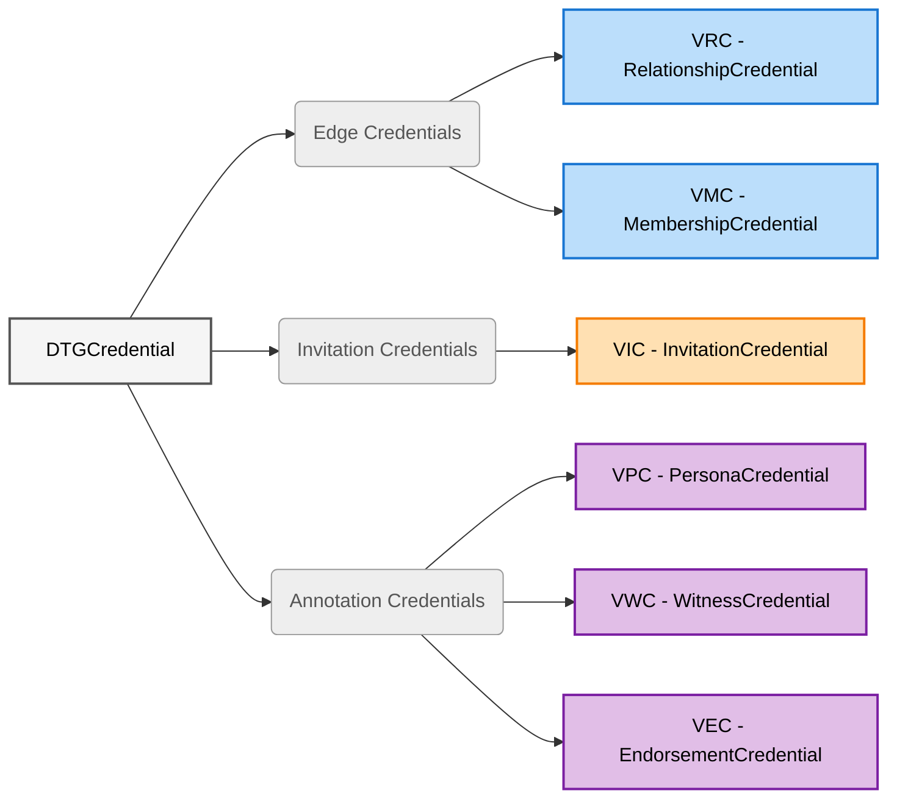

## DTG Credential Taxonomy

*This section is informative.*

This section provides a visual overview of the DTG Core Credential types and their formal type hierarchy. The three functional categories (edge, invitation, annotation) are descriptive aids only; they do not appear in credential schemas.


```mermaid
graph LR
    DTG[DTGCredential]

    DTG --> EC(Edge Credentials)
    DTG --> IC(Invitation Credentials)
    DTG --> AC(Annotation Credentials)

    EC --> VRC["VRC - RelationshipCredential"]
    EC --> VMC["VMC - MembershipCredential"]
    IC --> VIC["VIC - InvitationCredential"]
    AC --> VPC["VPC - PersonaCredential"]
    AC --> VWC["VWC - WitnessCredential"]
    AC --> VEC["VEC - EndorsementCredential"]

    classDef parent fill:#f5f5f5,stroke:#555,stroke-width:2px,color:#000
    classDef cat fill:#eeeeee,stroke:#999,stroke-width:1px,color:#555
    classDef edge fill:#bbdefb,stroke:#1976d2,stroke-width:2px,color:#000
    classDef inv fill:#ffe0b2,stroke:#f57c00,stroke-width:2px,color:#000
    classDef ann fill:#e1bee7,stroke:#7b1fa2,stroke-width:2px,color:#000

    class DTG parent
    class EC,IC,AC cat
    class VMC,VRC edge
    class VIC inv
    class VPC,VEC,VWC ann
```

### Formal W3C Type Hierarchy

```text
VerifiableCredential
└── DTGCredential
    ├── MembershipCredential (VMC)
    ├── RelationshipCredential (VRC)
    ├── InvitationCredential (VIC)
    ├── PersonaCredential (VPC)
    ├── EndorsementCredential (VEC)
    └── WitnessCredential (VWC)
```

> **Note:** The [[ref: r-card]] (relationship card) that appeared in earlier drafts of this specification is a [[ref: verifiable data structure]] (VDS), not a `DTGCredential` subtype. It will be defined in the planned **DTG Verifiable Data Structures** specification (see [Related Specifications](#related-specifications)).

## W3C Verifiable Credentials Version Support

This section is normative.

### Primary Standard: v2.0

This specification is written using **W3C Verifiable Credentials Data Model v2.0** syntax. All DTG implementations MUST support v2.0 credential verification and SHOULD support v2.0 credential issuance.

### Legacy System Compatibility: v1.1

Many existing [[ref: identity verification providers]] (IDVPs), [trust registries](https://glossary.trustoverip.org/#term:trust-registry), and community infrastructure may only support W3C VC Data Model v1.1. To ensure broad interoperability and avoid forcing costly system migrations:

- DTG implementations SHOULD accept and verify v1.1 credentials
- Existing credential issuers MAY issue DTG-compliant credentials using v1.1 syntax
- New implementations SHOULD prioritize v2.0 but MAY also issue v1.1 when required by ecosystem constraints

> **Design Intent:** This dual-version support enables:
>
> - Legacy IDVPs to issue [[ref: IDVCs]] (identity verification credentials) without system upgrades
> - Existing [[ref: VTCs]] to participate in the DTG using their current infrastructure
> - Gradual ecosystem migration from v1.1 to v2.0 without breaking trust relationships

### Property Mapping

The only differences between v1.1 and v2.0 DTG credentials are:

| Property | v1.1 | v2.0 |
| ---------- | ------ | ------ |
| **Context** | `https://www.w3.org/2018/credentials/v1` | `https://www.w3.org/ns/credentials/v2` |
| **Issuance** | `issuanceDate` | `validFrom` |
| **Expiration** | `expirationDate` | `validUntil` |

All DTG-specific schemas (types, issuer requirements, credentialSubject structure) are identical.

> **Implementation Note:** Verifiers supporting both v1.1 and v2.0 credentials MUST be able to process proof types commonly used in both versions. Issuers SHOULD use well-supported proof types and include all necessary contexts.

### Dual-Version Examples

**v2.0 (Primary):**

```json
{
  "@context": [
    "https://www.w3.org/ns/credentials/v2",
    "https://firstperson.network/credentials/dtg/v1"
  ],
  "type": ["VerifiableCredential", "DTGCredential", "MembershipCredential"],
  "issuer": "did:webvh:QmSbCcXWDDJmqE8m1nZ...:chess-club.example",
  "validFrom": "2026-01-06T10:00:00Z",
  "validUntil": "2027-01-06T10:00:00Z",
  "credentialSubject": {
    "id": "did:key:z6MkpTHR8VNs..."
  },
  "proof": {
    "type": "DataIntegrityProof",
    "cryptosuite": "eddsa-jcs-2022",
    "created": "2026-01-06T10:00:00Z",
    "proofPurpose": "assertionMethod",
    "verificationMethod": "did:webvh:QmSbCcXWDDJmqE8m1nZ...:chess-club.example#key-1",
    "proofValue": "z3FXQjecWJKT..."
  }
}
```

**v1.1 (Legacy Compatibility):**

```json
{
  "@context": [
    "https://www.w3.org/2018/credentials/v1",
    "https://firstperson.network/credentials/dtg/v1",
    "https://w3id.org/security/data-integrity/v2"
  ],
  "type": ["VerifiableCredential", "DTGCredential", "MembershipCredential"],
  "issuer": "did:webvh:QmSbCcXWDDJmqE8m1nZ...:chess-club.example",
  "issuanceDate": "2026-01-06T10:00:00Z",
  "expirationDate": "2027-01-06T10:00:00Z",
  "credentialSubject": {
    "id": "did:key:z6MkpTHR8VNs..."
  },
  "proof": {
    "type": "DataIntegrityProof",
    "cryptosuite": "eddsa-jcs-2022",
    "created": "2026-01-06T10:00:00Z",
    "proofPurpose": "assertionMethod",
    "verificationMethod": "did:webvh:QmSbCcXWDDJmqE8m1nZ...:chess-club.example#key-1",
    "proofValue": "z3FXQjecWJKT..."
  }
}
```

> **Note:** All examples in this specification use v2.0 syntax unless explicitly labeled otherwise. When implementing v1.1 support, use the property mappings above.

## Base Structure

This section is normative.

All DTG credentials share this W3C VC structure (v2.0 shown; see [Legacy System Compatibility](#legacy-system-compatibility-v11) for v1.1 compatibility):

**Schema:**

- `@context` (array, REQUIRED): MUST include `"https://www.w3.org/ns/credentials/v2"` and `"https://firstperson.network/credentials/dtg/v1"`, plus any additional contexts required by the proof type
- `type` (array, REQUIRED): MUST include `"VerifiableCredential"`, `"DTGCredential"`, and exactly one concrete subtype
- `issuer` (string, REQUIRED): DID of the issuing entity ([[ref: C-DID]], [[ref: M-DID]], [[ref: R-DID]], or [[ref: P-DID]] as appropriate)
- `validFrom` (string, REQUIRED): ISO 8601 datetime (`issuanceDate` in v1.1)
- `validUntil` (string, OPTIONAL): ISO 8601 datetime (`expirationDate` in v1.1)
- `credentialSubject` (object, REQUIRED):
  - `id` (string, REQUIRED): DID of the subject
  - Additional type-specific properties
- `taskContext` (string, OPTIONAL unless a credential type requires it): identifier of the [trust task](https://glossary.trustoverip.org/#term:trust-tasks) exchange in which this credential was issued — the `id` of that exchange's initiating document. See [Trust Task Context Binding](#trust-task-context-binding).
- `taskDigestMultibase` (string, REQUIRED wherever `taskContext` is REQUIRED, OPTIONAL otherwise): the tamper-evident binding of the exchange `taskContext` names — a digest of that exchange's initiating document. `taskContext` locates; `taskDigestMultibase` binds. See [Trust Task Context Binding](#trust-task-context-binding).
- `proof` (object, REQUIRED): A W3C Data Integrity proof. `proof.type` MUST be `DataIntegrityProof`, with the cryptographic suite named in `proof.cryptosuite` — algorithm agility lives in data rather than in type names, so a suite migration is a value change, not a schema revision. The RECOMMENDED suite is `eddsa-jcs-2022`: its JCS (RFC 8785) canonicalization requires no `@context` resolution at verification time, so credentials remain verifiable offline (including credentials formed in person and synchronized later), and it is the same canonicalization this specification uses for `digestMultibase` — a digest and a proof over one credential cannot disagree about the credential's canonical form. Selective-disclosure derivations require a `bbs-2023` **base proof** — an `eddsa-jcs-2022` proof cannot yield one — so issuers whose credentials must support selective disclosure issue a [proof set](https://www.w3.org/TR/vc-data-integrity/#proof-sets) carrying both suites: `eddsa-jcs-2022` for the offline path, `bbs-2023` as the derivation base. Note `bbs-2023` uses RDF canonicalization, so the no-`@context`-resolution argument above does not extend to the ZKP path (see [Zero-Knowledge and Selective Disclosure](#zero-knowledge-and-selective-disclosure)).

**Example:**

```json
{
  "@context": [
    "https://www.w3.org/ns/credentials/v2",
    "https://firstperson.network/credentials/dtg/v1"
  ],
  "type": ["VerifiableCredential", "DTGCredential", "MembershipCredential"],
  "issuer": "did:example:vtcCommunityDid",
  "validFrom": "2026-01-06T10:00:00Z",
  "validUntil": "2027-01-06T10:00:00Z",
  "credentialSubject": {
    "id": "did:example:memberMdid"
  },
  "proof": {
    "type": "DataIntegrityProof",
    "cryptosuite": "eddsa-jcs-2022",
    "created": "2026-01-06T10:00:00Z",
    "proofPurpose": "assertionMethod",
    "verificationMethod": "did:example:vtcCommunityDid#key-1",
    "proofValue": "z3FXQjecWJKT..."
  }
}
```

### DID Method Considerations

*This subsection is informative.*

This specification does not mandate a [decentralized identifier](https://glossary.trustoverip.org/#term:decentralized-identifier) method. The four [[ref: VID]] types — [[ref: R-DIDs]], [[ref: M-DIDs]], [[ref: C-DIDs]], and [[ref: P-DIDs]] — describe the role an identifier plays in the graph, not how it resolves, and a deployment may use different methods for different roles. Not every DID appearing in a DTG deployment is one of the four: a [[ref: VTA]] issuing a [[ref: VWC]] under [[ref: VTC]] policy, for instance, is named by none of them. What follows therefore states the properties a method must supply in terms of what the identifier is required to do, so that implementers can determine whether a candidate method is suitable — including for identifiers the four types do not name.

**Durable identifiers ([[ref: C-DIDs]], [[ref: M-DIDs]], and other long-lived issuers).** A [[ref: C-DID]] identifies a [[ref: VTC]] that issues [[ref: VMCs]] and is expected to outlive any particular key, operator, or hosting arrangement, and an [[ref: M-DID]] identifies a member across the lifetime of that membership. The determining property is how long the identifier must remain verifiable, not which [[ref: VID]] type it is: a [[ref: VTA]] issuing [[ref: VWCs]] on behalf of a [[ref: VTC]], which [VWC (Verifiable Witness Credential)](#vwc-verifiable-witness-credential) permits in place of an [[ref: M-DID]], must be verifiable for as long as the attestations it issued are relied upon, and so belongs here too. A method used for these roles should provide:

- **Verifiable key history**, so that a verifier can establish which key was authoritative when a credential was signed rather than only which key is authoritative now. This matters because a DTG credential may be presented long after issuance, and [Security Considerations](#security-considerations) requires verifiers to validate the verification method.
- **Key rotation without changing the identifier**, so that an edge of the graph survives key compromise. An identifier that cannot rotate makes every credential issued under it unrecoverable on compromise.
- **Pre-rotation or an equivalent commitment to successor keys**, limiting what an attacker holding a current key can do.
- **Independence from a single operator or hosting location**, so that loss of a domain does not sever the identifier from the graph built on it.
- **Discoverable service endpoints**, since the [[ref: VTA]] endpoints, `credentialStatus` mechanism, and [trust registry](https://glossary.trustoverip.org/#term:trust-registry) references relied on elsewhere in this specification are resolved through them.

Methods that publish a verifiable, append-only history of DID document versions — such as [did:webvh](https://identity.foundation/didwebvh/v1.0/), whose log entries commit to successor keys and may be countersigned by *DID log witnesses* — satisfy the first three properties. A DID log witness countersigns versions of a DID document and is a distinct role from the witness of a [[ref: VWC]], which attests to an edge; the two share only a name, and this subsection uses the qualified term wherever the DID log sense is meant.

Independence from a hosting location needs to be confirmed separately, because some methods make it a decision that can only be taken when the identifier is created. A `did:webvh` identifier resolves its log at a web origin and can be relocated only where the `portable` parameter was set in the first log entry; it defaults to off, and a later entry cannot enable it. Methods that separate the identifier from the location of its verification metadata — such as `did:scid`, under development at [ToIP](https://lf-toip.atlassian.net/wiki/spaces/HOME/pages/88572360/DID+SCID+Method+Specification), whose identifier is a self-certifying value that carries no location — do not present this choice at all. Implementers selecting a method for an identifier expected to outlive its current hosting arrangement should confirm both that the method supports relocation and that any capability which must be enabled at inception has been.

Methods that resolve to a document with no verifiable history, such as `did:web`, satisfy rotation and endpoint discovery but provide neither verifiable history nor any commitment to successor keys. Such a document is rotated by republishing it, which leaves a verifier unable to distinguish a legitimate rotation from a key substituted by an attacker, and unable to establish which key was authoritative at issuance.

**Pairwise identifiers ([[ref: R-DIDs]] and [[ref: P-DIDs]]).** An [[ref: R-DID]] identifies one peer to one other peer, and a [[ref: P-DID]] identifies a [[ref: persona]] within a bounded context. Both exist to limit correlation, and both are expected to be created in quantity. A method used for these roles should provide:

- **Cheap creation with no registration step**, since a deployment may mint one identifier per relationship or per persona.
- **No shared resolution origin**, so that resolving one identifier does not reveal the existence of, or a common controller for, the others. See [Privacy Considerations](#privacy-considerations).
- **No dependency on infrastructure that observes identifier use**, since a party that resolves, or acts as a DID log witness for, many of a person's pairwise identifiers is positioned to correlate them regardless of the identifiers themselves.

Peer and key-based methods such as `did:peer` and `did:key` satisfy these properties. A method requiring each identifier to be published at a web origin is a poor fit for these roles even where it is the right choice for a [[ref: C-DID]], because the origin is common to every identifier published under it.

**Mixing methods.** Because the properties above pull in opposite directions — durability and recoverability against disposability and non-correlation — implementations should expect to use more than one method, rather than seeking a single method that serves every role. Nothing in this specification requires the `issuer` and `credentialSubject.id` of a credential to use the same method, and the examples throughout reflect this: durable issuers are shown with `did:webvh` and pairwise subjects with `did:key` or `did:peer`.

## Edge Credentials

This section is normative.

Edge credentials establish relationships between existing entities (nodes) in the DTG: [[ref: VRCs]] attest to relationships between two entities, and [[ref: VMCs]] attest to community membership. In both cases, a bi-directional pair of credentials forms a complete [[ref: DTG edge]].

### VRC (Verifiable Relationship Credential)

**Purpose:** Attests to a relationship between two entities; two VRCs (one each direction) form a complete [[ref: DTG edge]].

**Schema:**

- `type` (array, REQUIRED): MUST include `"RelationshipCredential"`
- `issuer` (string, REQUIRED): [[ref: R-DID]] or [[ref: M-DID]] of the source party
- `credentialSubject` (object, REQUIRED):
  - `id` (string, REQUIRED): R-DID or M-DID of the target party

**Example:**

```json
{
  "@context": [
    "https://www.w3.org/ns/credentials/v2",
    "https://firstperson.network/credentials/dtg/v1"
  ],
  "type": ["VerifiableCredential", "DTGCredential", "RelationshipCredential"],
  "issuer": "did:peer:2.Ez6LSbysKZ...",
  "validFrom": "2026-01-06T10:00:00Z",
  "credentialSubject": {
    "id": "did:peer:2.Ez6LSpSrLxn..."
  },
  "proof": { "//": "..." }
}
```

**Note:** R-DIDs are RECOMMENDED for privacy; M-DIDs are allowed for bootstrapping (see [Privacy Considerations](#privacy-considerations)).

#### Unilateral Relationship Identification

A [[ref: relationship DID]] (R-DID) generated by a controller for the explicit purpose of establishing a VRC serves as a globally unique identifier for that relationship edge from the perspective of the controller.

Therefore, a relationship within the DTG can be canonically identified by two independent identifiers:

- The Source R-DID (controlled by the Issuer)
- The Target R-DID (controlled by the Subject)

Semantic statements, metadata, or private context regarding the relationship MAY be anchored solely to the controller's own R-DID, without requiring the resolution or inclusion of the counterparty's identifier.

> **IMPORTANT**: The valid application of this specification requires that each entity MUST generate a new, unique R-DID for every single entity they connect with, even within the same community.

#### Pairwise Zero-Knowledge Proof

The holder of a VRC MAY construct a zero-knowledge proof that demonstrates possession of a valid VRC and selectively discloses chosen attributes, subject DIDs, or predicates over them. A common application is to disclose the parties' [[ref: P-DIDs]] (persona DIDs) while hiding the underlying [[ref: R-DIDs]] (relationship DIDs), enabling a public, verifiable claim that two known [[ref: personas]] have a relationship without exposing the private pairwise channel between them or enabling correlation across the holder's other presentations. This construction is available to any two parties who hold a VRC between them, regardless of whether they share membership in a [[ref: VTC]]. It supports selective disclosure and minimal correlation across contexts. It does not by itself confer any community-level assurance (e.g., personhood); whatever assurance it carries derives from the parties' own out-of-band context, the public reputation attached to any disclosed persona DIDs, and the cryptographic integrity of the VRC.

### VMC (Verifiable Membership Credential)

**Purpose:** Attests to the membership of an entity in a [[ref: VTC]] or [[ref: VTN]]; two VMCs (one each direction) form a complete [[ref: DTG edge]].

**Schema:**

- `type` (array, REQUIRED): MUST include `"MembershipCredential"`
- `issuer` (string, REQUIRED): [[ref: C-DID]] of the VTC or VTN
- `credentialSubject` (object, REQUIRED):
  - `id` (string, REQUIRED): [[ref: M-DID]] of the member (person/device/agent) OR C-DID (for VTN-to-VTC membership)

**Example:**

```json
{
  "@context": [
    "https://www.w3.org/ns/credentials/v2",
    "https://firstperson.network/credentials/dtg/v1"
  ],
  "type": ["VerifiableCredential", "DTGCredential", "MembershipCredential"],
  "issuer": "did:webvh:QmSbCcXWDDJmqE8m1nZ...:chess-club.example",
  "validFrom": "2026-01-06T10:00:00Z",
  "credentialSubject": {
    "id": "did:key:z6MkpTHR8VNs..."
  },
  "proof": { "//": "..." }
}
```

#### Community-Anchored Zero-Knowledge Proof

A VRC is a signed verifiable credential. It MAY be presented and verified using standard W3C VC presentation methods when privacy preservation is not required, and it SHOULD be presented using a zero-knowledge proof whenever privacy preservation is desired. Community membership is **not** a precondition for issuing, holding, or presenting a VRC; two entities that do not share (or do not hold) a [[ref: VMC]] can still exchange VRCs, and the resulting edges are valid trust attestations standing on their cryptographic signatures and on whatever real-world context the parties bring to them.

When both parties to a VRC hold VMCs from the same community, the holder MAY construct a community-anchored ZKP of the relationship. In such a proof, the holder demonstrates:

1. Possession of the VRC
2. Possession of the underlying VMC (proving membership in the community)
3. The VRC issuer possesses a VMC from the *same* [[ref: C-DID]] (community DID)

This allows the relationship's existence to be proven within a shared community's governance context without revealing the specific DIDs or other credential details. Whatever assurances the community's trust registry attaches to its VMCs (e.g., personhood, when the VMCs qualify as [[ref: PHCs]]) carry forward into the proof.

This is one proof construction available to relationships within a shared community. Detailed ZK protocols and registry-ZK interactions are out of scope for this specification (see [Zero-Knowledge and Selective Disclosure](#zero-knowledge-and-selective-disclosure)).

**Note:** Implementations SHOULD make ZKP presentation the default behavior so that users obtain privacy preservation without having to opt in. See [Privacy Considerations](#privacy-considerations).

## Invitation Credentials

This section is normative.

### VIC (Verifiable Invitation Credential)

**Purpose:** Authorizes a prospective member to join a [[ref: VTC]] or [[ref: VTN]] when presented to the [[ref: VTA]]/[[ref: PEP]]. The [[ref: DTG invitation credential]] has two functional variants distinguished by issuer and subject rules (not by separate type strings): the [[ref: VTC invitation credential]] and the [[ref: VTN invitation credential]].

**Schema:**

- `type` (array, REQUIRED): MUST include `"InvitationCredential"`
- `issuer` (string, REQUIRED):
  - For VTC invitation: VTC [[ref: C-DID]] OR authorized member's [[ref: M-DID]] (per policy)
  - For VTN invitation: VTN C-DID OR member VTC's C-DID (per policy)
- `credentialSubject` (object, REQUIRED):
  - `id` (string, REQUIRED):
    - For VTC invitation: prospective member's M-DID OR prospective VTC's C-DID
    - For VTN invitation: prospective VTC's C-DID

**Example (VTC member invitation):**

```json
{
  "@context": [
    "https://www.w3.org/ns/credentials/v2",
    "https://firstperson.network/credentials/dtg/v1"
  ],
  "type": ["VerifiableCredential", "DTGCredential", "InvitationCredential"],
  "issuer": "did:key:z6MkhaXgBZD...",
  "validFrom": "2026-01-06T10:00:00Z",
  "validUntil": "2026-02-06T10:00:00Z",
  "credentialSubject": {
    "id": "did:key:z6MkpTHR8VNs..."
  },
  "proof": { "//": "..." }
}
```

> **Editor's note — roles and access control:** Roles and access control policy details are primarily inferred from the issuer plus the [trust registry](https://glossary.trustoverip.org/#term:trust-registry). An open question for this Working Draft is whether any of this information should be embedded in the VIC itself.

## Annotation Credentials

This section is normative.

Annotation credentials **do not create graph structure**. They attach data to existing edges or parties.

### VPC (Verifiable Persona Credential)

**Purpose:** Links a [[ref: persona DID]] (P-DID) to an existing relationship, enabling the holder to control intentional correlation across relationships.

**Schema:**

- `type` (array, REQUIRED): MUST include `"PersonaCredential"`
- `issuer` (string, REQUIRED): [[ref: P-DID]] of the persona
- `credentialSubject` (object, REQUIRED):
  - `id` (string, REQUIRED): Counterparty's DID (typically [[ref: R-DID]] or [[ref: M-DID]] used in the relationship)

**Example:**

```json
{
  "@context": [
    "https://www.w3.org/ns/credentials/v2",
    "https://firstperson.network/credentials/dtg/v1"
  ],
  "type": ["VerifiableCredential", "DTGCredential", "PersonaCredential"],
  "issuer": "did:key:z6MkrKqT9pL...",
  "validFrom": "2026-01-06T10:00:00Z",
  "credentialSubject": {
    "id": "did:peer:2.Ez6LSpSrLxn..."
  },
  "proof": { "//": "..." }
}
```

### VWC (Verifiable Witness Credential)

**Purpose:** Third-party attestation that an edge was established under specific conditions. The witness may be a person or a [[ref: VTA]] applying the witnessing policies of a [[ref: VTC]] — for example, verifying that both parties were present at the same event, or provided proof of biometric liveness at the time of relationship formation.

Because the meaning of a witness attestation depends on the conditions under which the witnessing occurred, a VWC MUST be bound to the [trust task](https://glossary.trustoverip.org/#term:trust-tasks) exchange in which it was issued via the `taskContext` property (see [Trust Task Context Binding](#trust-task-context-binding)).

A witnessed exchange of a complete [[ref: DTG edge]] is bidirectional: two VRCs, one in each direction, are formed in a single witnessing event. For such exchanges the witness SHOULD issue one VWC per direction. In each VWC, `credentialSubject.id` MUST be the DID of the issuer of the VRC that the VWC attests (the VRC referenced by `digestMultibase`), so that the two VWCs of an exchange are unambiguously bound to their respective directions.

A VWC's `credentialSubject.id` and `taskContext` alone identify only the observed party and the trust task exchange, not the edge being witnessed. Binding a VWC to a specific edge therefore requires `digestMultibase`: a verifier holding the referenced VRC can recover both relationship endpoints (the VRC's `issuer` and `credentialSubject.id`) and confirm the exact credential the witness attested to. This binding is only as strong as the verifier's access to that VRC — a `digestMultibase` without the referenced VRC to hand is an opaque hash, not an identified edge. Issuers and holders presenting a VWC as evidence of a specific edge SHOULD make the referenced VRC available alongside it. This trades off against minimal disclosure: a selectively-disclosed VRC cannot satisfy `digestMultibase` verification (the digest is over the full canonical form), so edge-binding verification and selective disclosure of the same VRC are mutually exclusive in one presentation.

**Schema:**

- `type` (array, REQUIRED): MUST include `"WitnessCredential"`
- `issuer` (string, REQUIRED): DID of the witness — an [[ref: M-DID]], or the DID of a [[ref: VTA]] acting according to VTC policy
- `taskContext` (string, REQUIRED): the `id` of the initiating document of the innermost trust task exchange that attests the witnessing (see [Trust Task Context Binding](#trust-task-context-binding))
- `taskDigestMultibase` (string, REQUIRED): the core specification's **task digest** ([framework 0.4, §4.9.3](https://github.com/trustoverip/dtgwg-trust-tasks-tf/blob/c59040d1e45700e1aa66d931f1397d661c4a7253/SPEC.md#493-the-task-digest)) of the initiating document `taskContext` names — computed over that document's JSON representation **excluding its top-level `proof` member** (§4.7 already excludes `proof` from what a proof covers, so the digest and the document's own signature commit to the same content, and the value is identical whether or not the document was proofed), canonicalized with JCS (RFC 8785), and encoded exactly as `digestMultibase` below — a SHA-256 multihash under a `z` or `u` multibase header. This is the tamper-evident half of the context binding: `taskContext` alone is an identifier an adversary can reuse on a counterfeit document (see [Trust Task Context Binding](#trust-task-context-binding))
- `credentialSubject` (object, REQUIRED):
  - `id` (string, REQUIRED): DID of the observed party
  - `digestMultibase` (string, REQUIRED): A cryptographic hash of the witnessed VRC, binding the VWC to the specific edge established, reusing the property name and multibase-multihash encoding the [W3C VC Data Model 2.0](https://www.w3.org/TR/vc-data-model-2.0/) defines (there for `relatedResource`, over raw bytes); the hash input here is defined by this specification, so generic tooling recognises the term and the encoding, not the input rule. The hash MUST be computed over the credential's JSON representation canonicalized with the JSON Canonicalization Scheme ([JCS, RFC 8785](https://datatracker.ietf.org/doc/html/rfc8785)), and MUST be encoded as a multibase-encoded multihash whose hash function is SHA-256 (multihash code `0x12`). The multibase header MUST be `z` (base58btc) or `u` (base64url-no-pad) — the two headers [W3C Controlled Identifiers 1.0 §2.4](https://www.w3.org/TR/cid-1.0/#multibase-0) defines for interoperable use — and consumers MUST enforce the named alphabet rather than assume it.
  - `witnessContext` (object, OPTIONAL): Context of the witnessing event
    - `event` (string, OPTIONAL): Human-readable event name
    - `sessionId` (string, OPTIONAL): Session or nonce identifier
    - `method` (string, OPTIONAL): Verification method used

**Example:**

```json
{
  "@context": [
    "https://www.w3.org/ns/credentials/v2",
    "https://firstperson.network/credentials/dtg/v1"
  ],
  "type": ["VerifiableCredential", "DTGCredential", "WitnessCredential"],
  "issuer": "did:webvh:QmVzTd9hRkPqLu4WgXyN...:witness-service.example",
  "validFrom": "2026-01-06T10:00:00Z",
  "taskContext": "2c7f5d19-6e0b-4c3d-8a41-9b2e6f0d4c88",
  "taskDigestMultibase": "zQmWhCFfStzUE4HGseiQ1XWi2eEp1GTQEKnt2jyBe7uqzXD",
  "credentialSubject": {
    "id": "did:key:z6MkpTHR8VNs...",
    "digestMultibase": "zQmdfTbBqBPQ7VNxZEYEj14VmRuZBkqFbiwReogJgS1zR1n",
    "witnessContext": {
      "event": "EthDenver 2024",
      "sessionId": "session-abc-123",
      "method": "in-person-proximity"
    }
  },
  "proof": { "//": "..." }
}
```

### VEC (Verifiable Endorsement Credential)

**Purpose:** Attaches endorsements (skills, reputation) to a party. The verifiability applies to cryptographic assurance in the issuer's signature, not to the truth of the assertions, whose vocabulary is defined by the governing [[ref: VTC]] or [[ref: VTN]].

**Schema:**

- `type` (array, REQUIRED): MUST include `"EndorsementCredential"`
- `issuer` (string, REQUIRED): DID of the endorser
- `credentialSubject` (object, REQUIRED):
  - `id` (string, REQUIRED): DID of the endorsed party
  - `endorsement` (object, REQUIRED): Community/VTN-defined endorsement structure
    - Structure and fields determined by community policy

**Example:**

```json
{
  "@context": [
    "https://www.w3.org/ns/credentials/v2",
    "https://firstperson.network/credentials/dtg/v1"
  ],
  "type": ["VerifiableCredential", "DTGCredential", "EndorsementCredential"],
  "issuer": "did:key:z6MkhaXgBZD...",
  "validFrom": "2026-01-06T10:00:00Z",
  "credentialSubject": {
    "id": "did:key:z6MkpTHR8VNs...",
    "endorsement": {
      "type": "SkillEndorsement",
      "name": "Software Development",
      "competencyLevel": "expert"
    }
  },
  "proof": { "//": "..." }
}
```

## Trust Task Context Binding

This section is normative.

DTG credentials are frequently issued during broader multi-step exchanges — [trust tasks](https://glossary.trustoverip.org/#term:trust-tasks) carried out through ceremonies governed by a [[ref: VTC]] or [[ref: VTN]] and structured as [Trust Task documents](https://github.com/trustoverip/dtgwg-trust-tasks-tf/blob/fbe196a8a17ba3f99d0657a64be5ac58621023a1/SPEC.md#4-trust-task-documents). A credential exchanged inside such a ceremony can be cryptographically valid as an artifact while still being insufficient evidence that the ceremony reached its intended terminal state. This section defines the mechanism that prevents such credentials from escaping their task context and being misinterpreted.

This section's normative dependency on the [[ref: Trust Tasks core specification]] is limited to mechanisms defined in that specification as of **0.4**, cited by name with the version pinned: document identity (§4.3), thread correlation and exchange citation (§4.9, §4.9.1), the reply-disposition classification (§8.6), the error payload's `inResponseTo` member (§8.2), and the per-variant proof-requirement and response-schema declarations (§7.3). It does not depend on any future or unpublished feature of that specification, or on the separate, still-planned DTG Core Trust Task Protocols specification. Citations name mechanisms rather than item ordinals, which its own revisions renumber.

### Credentials versus Trust Task Artifacts

The boundary between this specification and the [[ref: Trust Tasks core specification]] is drawn by the following test:

- A **credential** is a durable claim about the graph that is true standing alone (e.g., VRC, VMC, VPC). It lives on after the exchange in which it was issued.
- An **artifact** is a work-product of a trust task (intermediate or completion), only meaningful within its exchange. It is carried as a Trust Task document, correlated by a shared `threadId`, with its terminal state expressed at the trust task layer — not as a new credential type.

**Test for any new thing:** true outside the exchange? → credential. Only meaningful inside? → artifact.

All six credential types in this specification pass the credential side of this test. The structure of any individual trust task's outcome artifact is defined by the Trust Task specification governing that ceremony (see [Qualifying Trust Task Specifications](#qualifying-trust-task-specifications)) — a matter for the governing VTC/VTN, and out of scope for this specification.

### The `taskContext` Property

A credential whose meaning depends on a trust task completing MUST carry a `taskContext` property containing the **`id` of the initiating document** of the originating trust task exchange. Where exchanges nest, `taskContext` names the *innermost* exchange that attests the event, per the core specification's rule for [naming an exchange from outside the framework](https://github.com/trustoverip/dtgwg-trust-tasks-tf/blob/fbe196a8a17ba3f99d0657a64be5ac58621023a1/SPEC.md#491-naming-an-exchange-from-outside-the-framework) (framework 0.4, §4.9.1) — a witnessing nested inside a broader relationship exchange is attested by the witness ceremony's own exchange, not by the exchange that contains it. This requirement is a property of the credential type, not a per-issuer choice:

- For credential types where this specification marks `taskContext` as REQUIRED (currently only the [[ref: VWC]]), issuers MUST include it.
- For all other DTG credential types, `taskContext` is OPTIONAL.
- A DTG credential without a `taskContext` property MUST be interpretable standing alone, independent of any exchange.
- Uniqueness comes from the core specification rather than from issuer discipline: a document's [`id`](https://github.com/trustoverip/dtgwg-trust-tasks-tf/blob/fbe196a8a17ba3f99d0657a64be5ac58621023a1/SPEC.md#43-the-id-member) is "globally unique to this instance of the task" and producers "MUST NOT reuse an `id` value across documents" (framework 0.4, §4.3) — a normative obligation on a mandatory member. The exchange's `threadId` coincides with this value where the initiator relies on §4.9's fallback; where the initiator minted a `threadId`, the pairing rule in [Outcome Interpretability](#outcome-interpretability) pairs through the initiating document instead. Either way the anchor is the `id`: [`threadId`](https://github.com/trustoverip/dtgwg-trust-tasks-tf/blob/fbe196a8a17ba3f99d0657a64be5ac58621023a1/SPEC.md#49-the-threadid-member) remains optional in the core specification and carries no normative validation semantics.

**The `id` locates; it does not bind.** §4.3's uniqueness obligation constrains conforming producers — it constrains nobody else. An adversary can mint a different document carrying the same `id`, and a verifier pairing the credential with that counterfeit by `id` equality alone would accept evidence of the wrong event. A credential type that marks `taskContext` REQUIRED therefore also marks **`taskDigestMultibase`** REQUIRED, carrying the core specification's *task digest* of the initiating document ([framework 0.4, §4.9.3](https://github.com/trustoverip/dtgwg-trust-tasks-tf/blob/c59040d1e45700e1aa66d931f1397d661c4a7253/SPEC.md#493-the-task-digest): "a citation relied upon outside its exchange SHOULD carry a task digest over the document it names") — computed over the document's JSON representation excluding its top-level `proof` member, canonicalized with JCS (RFC 8785), in the same multihash/multibase encoding as `digestMultibase`. This specification strengthens the core specification's SHOULD to REQUIRED for the VWC, whose `taskContext` is exactly such a citation. The two properties split one job — `taskContext` is the locator (an O(1) lookup key, conformant with §4.9.1's citation rule), `taskDigestMultibase` is the binder (a counterfeit with the right `id` has the wrong bytes, so its digest cannot match). The digest excludes `proof` so the value is well-defined for unproofed documents and identical across proofed and unproofed forms of the same document.

The initiating document's own `proof.proofValue` was considered as the binder and rejected on two measured grounds: qualifying task specifications may leave the *request* proof OPTIONAL (the initiating document is a request — `witness/session` 0.1 declares exactly this), so a proofValue anchor is structurally unavailable on documents the specifications themselves permit; and a proofValue equality check is spoofable by copying the genuine proof block onto a counterfeit document — it only gains integrity behind full signature verification, which costs more than the digest recomputation it would replace. Where a proof happens to exist, its `proofValue` remains a fine index key; it is not the normative binding.

### Qualifying Trust Task Specifications

A `taskContext` value is only useful for the [Outcome Interpretability](#outcome-interpretability) rule below if the trust task exchange it identifies produces observable, integrity-protected, in-band terminal-state evidence. A governance framework (VTC or VTN) that designates the Trust Task specification governing a `taskContext`-bearing ceremony MUST select or define one that, per the [[ref: Trust Tasks core specification]]:

1. declares `proof` as REQUIRED for its success-response variant — either as a single specification-wide requirement or via the per-variant declaration (framework 0.4, [§7.3](https://github.com/trustoverip/dtgwg-trust-tasks-tf/blob/fbe196a8a17ba3f99d0657a64be5ac58621023a1/SPEC.md#73-specification-requirements)), so the resulting outcome evidence is integrity-protected. (A task specification cannot strengthen the *error* variant: an error response's `type` names the reserved [`trust-task-error`](https://github.com/trustoverip/dtgwg-trust-tasks-tf/blob/fbe196a8a17ba3f99d0657a64be5ac58621023a1/SPEC.md#8-error-responses) specification, whose declaration no other specification can override — which is one reason error responses are not completion evidence under [Outcome Interpretability](#outcome-interpretability).) And
2. defines a `#response` success-response payload schema (framework 0.4, [§4.4.1](https://github.com/trustoverip/dtgwg-trust-tasks-tf/blob/fbe196a8a17ba3f99d0657a64be5ac58621023a1/SPEC.md#441-request-and-response-variants) and the response-schema requirement of [§7.3](https://github.com/trustoverip/dtgwg-trust-tasks-tf/blob/fbe196a8a17ba3f99d0657a64be5ac58621023a1/SPEC.md#73-specification-requirements)) — so that successful termination is observable directly from the exchange's Trust Task documents. A specification with no success response can only ever record failure, so a `taskContext` pointing at one could never carry positive outcome evidence.

Any Trust Task specification meeting these two conditions qualifies, whether or not it is specific to DTG ceremonies. This specification does not define such a Trust Task specification itself; doing so is the responsibility of the governing VTC/VTN, coordinated where applicable with the Trust Tasks task force (see [Governance Considerations](#governance-considerations)).

### Outcome Interpretability

A verifier MUST NOT interpret a `taskContext`-bearing credential as proof that the associated trust task or ceremony completed unless matching trust task outcome evidence is also present and verified. Which reply documents are terminal is the core specification's classification, not this document's — a success response closes an exchange, an error response closes it, and a next-step reply leaves it open (framework 0.4, [§8.6](https://github.com/trustoverip/dtgwg-trust-tasks-tf/blob/fbe196a8a17ba3f99d0657a64be5ac58621023a1/SPEC.md#86-reserved-response-type-slugs)); this specification cites that classification rather than restating it, so reply types the core specification adds are classified where they are specified.

**Matching outcome evidence** is the exchange's initiating document together with a terminal Trust Task document, where:

- the initiating document's `id` equals the credential's `taskContext`, **and the credential's `taskDigestMultibase` reproduces over it** — recomputed over the document's JCS (RFC 8785) canonical form excluding its top-level `proof` member, and compared as **decoded multihash bytes, never as encoded strings** (framework 0.4, §4.9.3: `z` and `u` encodings of one digest are different strings, so a string compare rejects a valid pairing). `id` equality alone MUST NOT be treated as binding: it locates a candidate document; only the digest match confirms it is *the* document;
- the terminal document carries a `threadId` equal to the initiating document's `threadId` where the initiator minted one, and to the initiating document's `id` (the credential's `taskContext`) under §4.9's fallback — that is, `terminal.threadId == (initiating.threadId ?? initiating.id)`. Pairing runs through the initiating document precisely so that an initiator exercising §4.9's freedom to mint a fresh `threadId` does not orphan legitimate outcome evidence;
- the terminal document carries a `type` that is the originating request's Type URI with the `#response` fragment — the qualifying specification's terminal *success* form; and
- the terminal document carries a `proof` that verifies under that specification's declared requirement, and whose `issuer` is the party the qualifying specification names as the responder of that exchange (for a witnessed ceremony, the witness) — evidence signed by the wrong party pairs with nothing.

A `trust-task-error` terminating the exchange is evidence of *failure*, never of completion: a verifier MUST NOT infer completion from one, and MUST NOT rely on one as attributable third-party evidence unless it carries the core specification's `inResponseTo` member (framework 0.4, [§8.2](https://github.com/trustoverip/dtgwg-trust-tasks-tf/blob/fbe196a8a17ba3f99d0657a64be5ac58621023a1/SPEC.md#82-error-payload)) naming the originating document — without it, a retained error names neither the task nor the specification whose semantics its code carries, and is diagnostic for the exchange's parties only.

A holder presenting a `taskContext`-bearing credential as evidence of task completion MUST include matching outcome evidence with the presentation. Discovering or retrieving outcome evidence that a verifier does not already hold is out of scope for this version of this specification: a verifier that does not receive matching outcome evidence together with the presentation MUST treat the credential as not evidencing task completion, regardless of whether such evidence exists elsewhere. This does not otherwise invalidate the credential — a `taskContext`-bearing credential remains subject to ordinary verification (issuer authorization, proof, revocation status) independent of outcome evidence; only the completion inference is withheld absent matching evidence.

## Supporting Concepts

*This section is informative.*

### Personhood Credentials (PHC)

A [[ref: PHC]] is simply a [[ref: VMC]] issued by a [[ref: VTC]] whose governance enforces:

- Real human personhood
- Exactly one membership per person

No additional schema fields are required. PHC status is determined by governance and trust registries, not by credential structure. Issuers may optionally add `"PersonhoodCredential"` to the `type` array as a non-authoritative hint.

**Example:**

```json
{
  "type": [
    "VerifiableCredential",
    "DTGCredential",
    "MembershipCredential",
    "PersonhoodCredential"
  ],
  "issuer": "did:webvh:QmRfN7pKwEbTs2LcMqDh...:government-idv.example",
  "credentialSubject": {
    "id": "did:key:z6MkpTHR8VNs..."
  }
}
```

### Trust Registries

- **Authoritative source** for roles ([[ref: initiator]], [trust anchor](https://glossary.trustoverip.org/#term:trust-anchor), member, [[ref: IDVP]], etc.)
- Map DIDs to roles and policies
- Determine acceptable issuers
- Schema and APIs out of scope for this specification
- Handle revocations, etc.

### Identity Verification Credentials (IDVC)

- [[ref: IDVCs]] are **not** `DTGCredential` subtypes
- Any W3C VC satisfying a VTC/VTN's identity-proofing requirements
- Issuers, assurance levels, and requirements governed by VTC/VTN policy and trust registries

### Zero-Knowledge and Selective Disclosure

- The ZKP *constructions* below are format-agnostic; where a concrete Data Integrity mechanism is needed, this specification names `bbs-2023` as the selective-disclosure suite (issued as part of a proof set — see the `proof` member under [Base Structure](#base-structure))
- Two ZKP constructions are defined for proving relationships: the [Pairwise Zero-Knowledge Proof](#pairwise-zero-knowledge-proof) (available to any two VRC holders) and the [Community-Anchored Zero-Knowledge Proof](#community-anchored-zero-knowledge-proof) (available when both parties hold VMCs from the same community)
- Schemas are kept simple to enable common predicates:
  - "Holder has valid VMC from recognized VTC"
  - "Issuer is authorized member"
  - "Two distinct VRCs exist"
- Detailed ZK protocols and registry-ZK interactions are left to future work

## Security Considerations

*This section is informative.*

1. **Proof verification.** Verifiers must cryptographically verify the `proof` of every DTG credential, including resolution of the issuer's DID and validation of the verification method, before relying on any claim in the credential.
2. **Validity period enforcement.** Verifiers must reject credentials outside their `validFrom`/`validUntil` window (or v1.1 equivalents) and should check applicable revocation status via the governing trust registry.
3. **Issuer authorization.** A cryptographically valid credential is not necessarily an authorized one. Verifiers must evaluate whether the issuer is authorized for the claimed role (e.g., a VMC issuer being a recognized VTC, a VIC issuer being permitted to invite) using the applicable trust registry or governance framework.
4. **Digest integrity (VWC).** A verifier relying on a VWC's binding to a specific edge must have the referenced VRC available, recompute the SHA-256 multihash over its JCS (RFC 8785) canonical form, compare it under the credential's multibase header (enforcing that header's alphabet), and confirm it matches `digestMultibase`; a mismatch invalidates the attestation. Without the referenced VRC in hand, `digestMultibase` cannot be resolved to an edge, and the VWC should not be treated as evidence of which edge was witnessed. The same discipline applies to `taskDigestMultibase` against the exchange's initiating document (excluding its top-level `proof` member), with two rules from the core specification's task-digest definition (framework 0.4, §4.9.3): comparison is over decoded multihash bytes, never encoded strings; and an unimplemented hash algorithm leaves the citation *unverified* — never recomputed under a substitute algorithm, never silently downgraded to `id` comparison. A document whose `id` matches `taskContext` but whose digest does not reproduce is a counterfeit context, and the attestation MUST NOT be paired with it — `id` equality is a lookup, not a binding.
5. **Context collapse.** A credential presented outside the trust task exchange in which it was issued may be misinterpreted as evidence of a completed ceremony. The requirements of [Trust Task Context Binding](#trust-task-context-binding) exist to prevent this class of attack and must be enforced by verifiers.
6. **Replay of invitation credentials.** VICs should be issued with short validity periods and should be treated as single-use by the accepting [[ref: VTA]]/[[ref: PEP]], to prevent replay of an intercepted invitation.
7. **Key compromise.** Compromise of the private key controlling any DID used in a DTG credential (issuer or subject) undermines all credentials anchored to it. Key rotation and revocation procedures are governed by the applicable DID methods and trust registries.

## Privacy Considerations

*This section is informative.*

1. **M-DID reuse.** Reuse of an [[ref: M-DID]] across multiple relationships is allowed for bootstrapping, but implementers should carefully consider correlation risks. Migration from M-DID-based to [[ref: R-DID]]-based edges is recommended post-bootstrapping for enhanced privacy.
2. **R-DID uniqueness.** As required in [Unilateral Relationship Identification](#unilateral-relationship-identification), each entity must generate a new, unique R-DID for every entity it connects with. Reusing an R-DID across counterparties creates unintended correlation.
3. **Intentional correlation via personas.** Correlation across relationships should occur only through the holder's deliberate assertion of a [[ref: persona]] (via a [[ref: VPC]]) or an M-DID — never as a side effect of credential structure.
4. **Minimal disclosure.** DTG credential schemas are intentionally minimal so that holders can satisfy common predicates (membership, relationship existence) using zero-knowledge or selective disclosure mechanisms without revealing underlying DIDs or credential contents.
5. **Witness data.** The optional `witnessContext` of a [[ref: VWC]] may reveal information about where and when parties met. Issuers should include only what the witnessing purpose requires, and holders should be able to withhold `witnessContext` details when proving the attestation.
6. **ZKPs by default.** Implementations should use ZKP presentation by default so that privacy preservation does not require any extra effort on behalf of users.
7. **Correlation through the resolution layer.** Correlation does not require the credentials themselves. Where several of a party's [[ref: R-DIDs]] or [[ref: P-DIDs]] resolve through common infrastructure — a shared web origin, a shared registry, or a shared set of DID log witnesses countersigning their updates — that infrastructure can associate identifiers that the credential structure was designed to keep apart, and can observe when each is used. Choosing a DID method for these roles is therefore a privacy decision as much as a key management one; see [DID Method Considerations](#did-method-considerations).

## Governance Considerations

*This section is informative.*

This specification deliberately delegates most policy decisions to the governance frameworks of individual [[ref: VTCs]] and [[ref: VTNs]], consistent with the [ToIP Governance Metamodel](https://trustoverip.org/wp-content/uploads/ToIP-Governance-Metamodel-Specification-V1.0-2021-12-21.pdf):

1. Membership criteria, invitation policies, and identity-proofing requirements (including acceptable [[ref: IDVPs]] and [[ref: IDVCs]]) are defined by each community's governance framework and published via trust registries.
2. Whether a [[ref: VMC]] qualifies as a [[ref: PHC]] is a governance determination, not a schema property.
3. Endorsement vocabularies for [[ref: VECs]] and witnessing policies for [[ref: VWCs]] are defined by the governing VTC or VTN.
4. New credential types proposed by higher-layer trust task protocol specifications are expected to be coordinated between the DTGWG task forces responsible for credentials and trust tasks.

## Internationalization Considerations

*This section is informative.*

Human-readable values in DTG credentials (e.g., endorsement names, witness event names) are community-defined and may appear in any language. Detailed internationalization guidance will be completed before this specification advances beyond Working Draft status.

## Accessibility Considerations

*This section is informative.*

This specification defines data structures rather than user interfaces. Accessibility guidance for implementations presenting DTG credentials to users will be completed before this specification advances beyond Working Draft status.

## Conformance

This section is normative.

This specification defines normative requirements, using the keywords defined in [Requirements Language](#requirements-language), for the following conformance targets:

### Conformance Targets

1. **Issuers** — entities that issue DTG credentials. A conforming issuer MUST produce credentials that satisfy the [Base Structure](#base-structure) and the schema of the concrete credential type, including the `taskContext` requirements of [Trust Task Context Binding](#trust-task-context-binding).
2. **Holders** — entities that store and present DTG credentials. A conforming holder MUST present credentials without altering their contents and, when presenting a `taskContext`-bearing credential as evidence of task completion, MUST include matching trust task outcome evidence (as defined in [Outcome Interpretability](#outcome-interpretability)) with the presentation.
3. **Verifiers** — entities that verify DTG credentials and presentations. A conforming verifier MUST implement the verification requirements of the [Security Considerations](#security-considerations) and the outcome interpretability rule of [Trust Task Context Binding](#trust-task-context-binding), and MUST support W3C VC Data Model v2.0 verification per [W3C Verifiable Credentials Version Support](#w3c-verifiable-credentials-version-support).

### Conformance Tests

Conformance test suites for this specification have not yet been defined and are expected to be developed as the specification matures toward Working Group Approved Deliverable status.

## References

### Normative References

- [W3C Verifiable Credentials Data Model v2.0](https://www.w3.org/TR/vc-data-model-2.0/)
- [W3C Verifiable Credentials Data Model v1.1](https://www.w3.org/TR/vc-data-model/)
- [W3C Decentralized Identifiers (DIDs) v1.0](https://www.w3.org/TR/did-1.0/)
- [IETF RFC 2119: Key words for use in RFCs to Indicate Requirement Levels](https://datatracker.ietf.org/doc/html/rfc2119)
- [IETF RFC 8785: JSON Canonicalization Scheme (JCS)](https://datatracker.ietf.org/doc/html/rfc8785)
- [W3C Verifiable Credential Data Integrity 1.0](https://www.w3.org/TR/vc-data-integrity/) — the `DataIntegrityProof` envelope
- [W3C Data Integrity EdDSA Cryptosuites v1.0](https://www.w3.org/TR/vc-di-eddsa/) — `eddsa-jcs-2022` (and `eddsa-rdfc-2022`)
- [W3C Data Integrity BBS Cryptosuites v1.0](https://www.w3.org/TR/vc-di-bbs/) — `bbs-2023`, the selective-disclosure suite
- [W3C Controlled Identifiers (CIDs) v1.0](https://www.w3.org/TR/cid-1.0/) — the `z`/`u` multibase headers
- [ISO 8601: Date and time format](https://www.iso.org/iso-8601-date-and-time-format.html)
- [Trust Tasks Framework, DTGWG Trust Tasks Task Force editor's draft](https://github.com/trustoverip/dtgwg-trust-tasks-tf/blob/fbe196a8a17ba3f99d0657a64be5ac58621023a1/SPEC.md) — this specification's normative references in [Trust Task Context Binding](#trust-task-context-binding) are to mechanisms of the [[ref: Trust Tasks core specification]] as of **framework 0.4** (0.4 per that document's Appendix B changelog; its header at that commit still reads 0.3; commit [`fbe196a`](https://github.com/trustoverip/dtgwg-trust-tasks-tf/blob/fbe196a8a17ba3f99d0657a64be5ac58621023a1/SPEC.md), which the section links resolve to), cited by name: document identity (§4.3), request/response variants (§4.4.1), thread correlation and exchange citation (§4.9, §4.9.1, §4.9.2), specification requirements (§7.3, the per-variant proof and response-schema declarations), error responses and the `inResponseTo` member (§8, §8.2), and the reply-disposition classification (§8.6). The dependency is on those already-defined mechanisms only, not on future revisions.

### Informative References

- [ToIP Trust Registry Query Protocol](https://trustoverip.github.io/tswg-trust-registry-protocol/)
- [ToIP Governance Metamodel Specification V1.0](https://trustoverip.org/wp-content/uploads/ToIP-Governance-Metamodel-Specification-V1.0-2021-12-21.pdf)
- [Trust Tasks (ToIP Glossary)](https://glossary.trustoverip.org/#term:trust-tasks) and the community proposals at [trusttasks.org](https://www.trusttasks.org)
- [IETF RFC 7095: jCard: The JSON Format for vCard](https://datatracker.ietf.org/doc/html/rfc7095)
- [Agent2Agent (A2A) Protocol: AgentCard](https://agent2agent.info/docs/concepts/agentcard/)
- [Personhood Credentials (arXiv:2408.07892)](https://arxiv.org/abs/2408.07892)
- [DTG Credentials v0.3 proposal draft](https://github.com/trustoverip/dtgwg-cred-tf/blob/main/dtg.md) (superseded by this specification)
