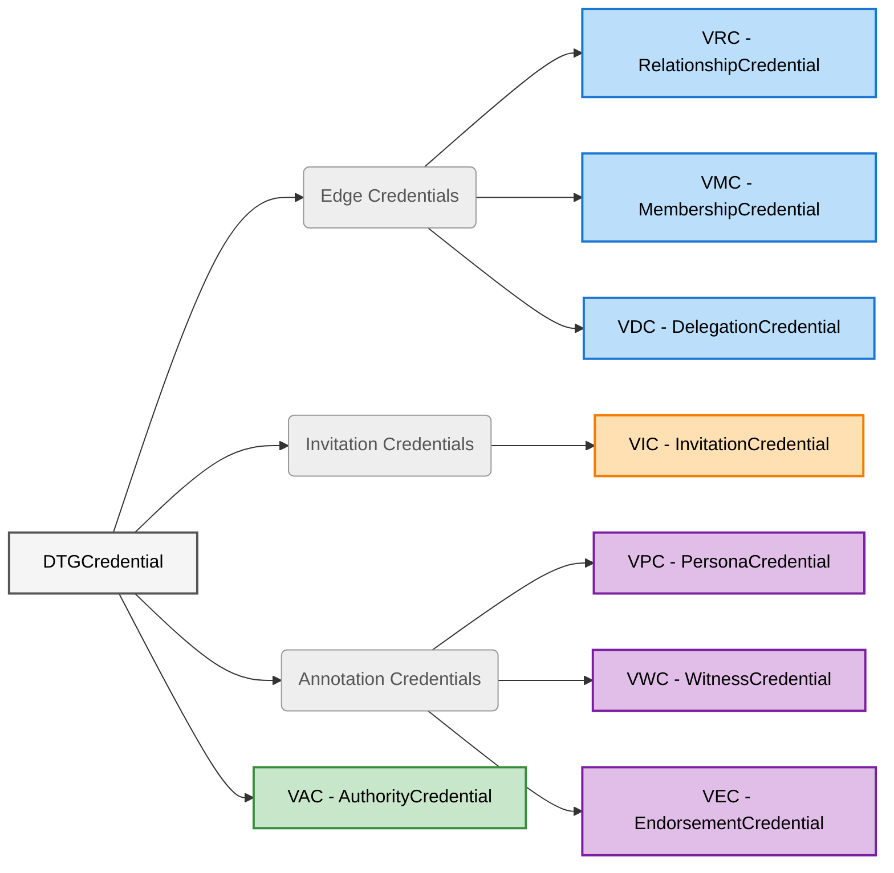

## DTG Credential Taxonomy

*This section is informative.*

This section provides a visual overview of the DTG Core Credential types and their formal type hierarchy. The functional categories (edge, invitation, annotation) are descriptive aids only; they do not appear in credential schemas. The [[ref: VAC]] belongs to none of them — it neither forms a graph edge nor annotates existing structure — and is shown attached directly to `DTGCredential`. See the editorial note in [VAC](#vac-verifiable-authority-credential).


```mermaid
graph LR
    DTG[DTGCredential]

    DTG --> EC(Edge Credentials)
    DTG --> IC(Invitation Credentials)
    DTG --> AC(Annotation Credentials)

    EC --> VRC["VRC - RelationshipCredential"]
    EC --> VMC["VMC - MembershipCredential"]
    EC --> VDC["VDC - DelegationCredential"]
    IC --> VIC["VIC - InvitationCredential"]
    AC --> VPC["VPC - PersonaCredential"]
    AC --> VWC["VWC - WitnessCredential"]
    AC --> VEC["VEC - EndorsementCredential"]
    DTG --> VAC["VAC - AuthorityCredential"]

    classDef parent fill:#f5f5f5,stroke:#555,stroke-width:2px,color:#000
    classDef cat fill:#eeeeee,stroke:#999,stroke-width:1px,color:#555
    classDef edge fill:#bbdefb,stroke:#1976d2,stroke-width:2px,color:#000
    classDef inv fill:#ffe0b2,stroke:#f57c00,stroke-width:2px,color:#000
    classDef ann fill:#e1bee7,stroke:#7b1fa2,stroke-width:2px,color:#000

    classDef auth fill:#c8e6c9,stroke:#388e3c,stroke-width:2px,color:#000

    class DTG parent
    class EC,IC,AC cat
    class VMC,VRC,VDC edge
    class VIC inv
    class VPC,VEC,VWC ann
    class VAC auth
```

### Formal W3C Type Hierarchy

```text
VerifiableCredential
└── DTGCredential
    ├── MembershipCredential (VMC)
    ├── RelationshipCredential (VRC)
    ├── DelegationCredential (VDC)
    ├── InvitationCredential (VIC)
    ├── PersonaCredential (VPC)
    ├── EndorsementCredential (VEC)
    ├── WitnessCredential (VWC)
    └── AuthorityCredential (VAC)
```

> **Note:** The [[ref: r-card]] (relationship card) that appeared in earlier drafts of this specification is a [[ref: verifiable data structure]] (VDS), not a `DTGCredential` subtype. It will be defined in the planned **DTG Verifiable Data Structures** specification (see [Related Specifications](#related-specifications)).

## W3C Verifiable Credentials Version Support

This section is normative.

### Primary Standard: v2.0

This specification is written using **W3C Verifiable Credentials Data Model v2.0** syntax. All DTG implementations MUST support v2.0 credential verification and SHOULD support v2.0 credential issuance.

### Legacy System Compatibility: v1.1

Many existing [[ref: identity verification providers]] (IDVPs), [trust registries](https://glossary.trustoverip.org/#term:trust-registry), and community infrastructure may only support W3C VC Data Model v1.1. To ensure broad interoperability and avoid forcing costly system migrations:

- DTG implementations SHOULD accept and verify v1.1 credentials
- Existing credential issuers MAY issue DTG-compliant credentials using v1.1 syntax
- New implementations SHOULD prioritize v2.0 but MAY also issue v1.1 when required by ecosystem constraints

> **Design Intent:** This dual-version support enables:
>
> - Legacy IDVPs to issue [[ref: IDVCs]] (identity verification credentials) without system upgrades
> - Existing [[ref: VTCs]] to participate in the DTG using their current infrastructure
> - Gradual ecosystem migration from v1.1 to v2.0 without breaking trust relationships

### Property Mapping

The only differences between v1.1 and v2.0 DTG credentials are:

| Property | v1.1 | v2.0 |
| ---------- | ------ | ------ |
| **Context** | `https://www.w3.org/2018/credentials/v1` | `https://www.w3.org/ns/credentials/v2` |
| **Issuance** | `issuanceDate` | `validFrom` |
| **Expiration** | `expirationDate` | `validUntil` |

All DTG-specific schemas (types, issuer requirements, credentialSubject structure) are identical.

> **Implementation Note:** Verifiers supporting both v1.1 and v2.0 credentials MUST be able to process proof types commonly used in both versions. Issuers SHOULD use well-supported proof types and include all necessary contexts.

### Dual-Version Examples

For readability, the examples throughout this specification reuse a single member identifier across a community's credentials. Under a declaration that identifier is `directed`, not `pairwise`; see [Correlation Scope](#correlation-scope).

**v2.0 (Primary):**

```json
{
  "@context": [
    "https://www.w3.org/ns/credentials/v2",
    "https://firstperson.network/credentials/dtg/v1",
    "https://w3id.org/security/suites/ed25519-2020/v1"
  ],
  "type": ["VerifiableCredential", "DTGCredential", "MembershipCredential"],
  "issuer": "did:webvh:QmSbCcXWDDJmqE8m1nZ...:chess-club.example",
  "validFrom": "2026-01-06T10:00:00Z",
  "validUntil": "2027-01-06T10:00:00Z",
  "credentialSubject": {
    "id": "did:key:z6MkpTHR8VNs..."
  },
  "proof": {
    "type": "Ed25519Signature2020",
    "created": "2026-01-06T10:00:00Z",
    "proofPurpose": "assertionMethod",
    "verificationMethod": "did:webvh:QmSbCcXWDDJmqE8m1nZ...:chess-club.example#key-1",
    "proofValue": "z3FXQjecWJKT..."
  }
}
```

**v1.1 (Legacy Compatibility):**

```json
{
  "@context": [
    "https://www.w3.org/2018/credentials/v1",
    "https://firstperson.network/credentials/dtg/v1",
    "https://w3id.org/security/suites/ed25519-2020/v1"
  ],
  "type": ["VerifiableCredential", "DTGCredential", "MembershipCredential"],
  "issuer": "did:webvh:QmSbCcXWDDJmqE8m1nZ...:chess-club.example",
  "issuanceDate": "2026-01-06T10:00:00Z",
  "expirationDate": "2027-01-06T10:00:00Z",
  "credentialSubject": {
    "id": "did:key:z6MkpTHR8VNs..."
  },
  "proof": {
    "type": "Ed25519Signature2020",
    "created": "2026-01-06T10:00:00Z",
    "proofPurpose": "assertionMethod",
    "verificationMethod": "did:webvh:QmSbCcXWDDJmqE8m1nZ...:chess-club.example#key-1",
    "proofValue": "z3FXQjecWJKT..."
  }
}
```

> **Note:** All examples in this specification use v2.0 syntax unless explicitly labeled otherwise. When implementing v1.1 support, use the property mappings above.

## Correlation Scope

This section is normative, except where a subsection is marked informative. Its
requirements apply to a **[[ref: correlation scope]]** that has been declared;
this version does not yet define where a declaration is carried (see
[Declaring scope](#declaring-scope)), so no credential is non-conforming for the
absence of one.

A [[ref: DTG verifiable identifier]] MAY carry a declared correlation scope: the
breadth over which its holder intends it to be correlated. Scope is declared by
the holder, and is independent of the role the holder plays — which is
established by the credentials the identifier appears in. A role may nonetheless
constrain which scopes a holder can *truthfully* declare, as it does for a
[[ref: VTC]]'s own identifier and for a [[ref: VWC]] witness's; a role never
supplies the scope, it only rules some declarations out.

| Scope | Known to | Holder's intent |
|---|---|---|
| `pairwise` | exactly one counterparty | correlation confined to this one relationship |
| `directed` | a set of counterparties the holder chooses | deliberate correlation across that set and no further |
| `public` | unbounded | correlation unbounded; ordinarily published so that it can be found |

A *counterparty* here is a party to a relationship the identifier establishes
or annotates. Disclosure to a party in a supporting role for that same
relationship — a [[ref: VWC]] witness, an [[ref: IDVP]] performing identity
proofing for a membership, or the resolution infrastructure the identifier
depends on — does not by itself widen scope, though it does place the identifier
beyond the holder's control; see
[Privacy Considerations](#privacy-considerations).

The values are **ordered**, narrowest first. Where this specification states a
minimum scope for a purpose, a declaration narrower than that minimum does not
satisfy it, and a verifier MUST NOT treat it as if it did; elsewhere a holder
MAY declare any of the three. A verifier MUST NOT rely on an identifier's value,
its DID method, or the context in which it was encountered as a substitute for a
declaration.

There are three values rather than four because each must answer the same
question — *who may correlate this identifier?* — and answer it by the holder's
own choice. `pairwise` confines correlation to one counterparty, `directed`
confines it to a set the holder directs the identifier at, and `public` declines
to confine it. There is deliberately no separate value for an identifier used
within a community: an identifier a member uses only with the community is
`pairwise`, and one the member also uses with other members is `directed`. A
value bounded by the community would take its bound from a credential rather
than from the holder — the conflation this section exists to remove — and would
give a verifier two middle values it has no way to tell apart. What such a value
appeared to capture is a property of the community rather than of the
identifier; see
[Scope the holder cannot declare alone](#scope-the-holder-cannot-declare-alone).

### Roles are conferred by credentials

An identifier is not "a membership identifier"; it is an identifier that *has* a
[[ref: VMC]]. It is not "a persona identifier"; it is one that *has* a
[[ref: VPC]]. Membership is still established by the VMC pair and a
[[ref: persona]] is still asserted by a VPC; a scope declaration is orthogonal to
both.

The R-DID (relationship), M-DID (membership), C-DID (community) and P-DID
(persona) identifier types used in drafts before WD02 are retired. Each named a
role and a correlation width in one token, and the two can disagree — an
identifier holding a VMC and issuing a VRC answered to two of the four names at
once.

### Choosing a scope

*This subsection is informative.*

Because scope is the holder's choice, it is a choice a person can be asked to
make — at the moment of joining a community, and again for each relationship.
Three values are few enough to put in front of a human being:

1. **`pairwise` — a single-counterparty pseudonym.** Known to this counterparty
   and to no other, and not necessarily short-lived: a `pairwise` identifier
   toward a [[ref: VTC]] lasts as long as the membership. Where the counterparty
   is a VTC, that means known to the [[ref: VTA]] and not to fellow members.
2. **`directed` — a private persona.** Known to this counterparty and to whoever
   else the holder chooses, which may include other members of the same
   community, or parties in other communities. This is the identifier under
   which a [[ref: persona]] is ordinarily asserted.
3. **`public` — a public persona.** Known to anyone.

The three values also determine when proving *intentional* correlation costs
anything. Where a holder deliberately uses one `directed` or `public` identifier
across several credentials, the correlation is evident on the face of them and
needs no proof. A zero-knowledge proof of common control is needed only in the
opposite case: where the holder has used `pairwise` identifiers, which are
distinct by definition, or distinct `directed` or `public` identifiers, and
wishes to demonstrate that a single party controls them all.

### Scope the holder cannot declare alone

A declared scope binds its holder's own disclosure. It does not bind what a
counterparty does with the identifier once disclosed, and for one counterparty —
a community — that gap is wide enough to require governance.

A member may declare the identifier they use with a [[ref: VTC]] `pairwise`, but
that declaration stays truthful only if the VTC keeps it so. A VTC that
publishes a member directory, or that presents a member-issued [[ref: VMC]] to a
third party as [Privacy Considerations](#privacy-considerations) permits, has
widened the identifier's exposure without the member having chosen it.

A VTC that issues VMCs MUST therefore publish, in its governance framework or
its trust registry, whether member identifiers are disclosed beyond the
[[ref: VTA]] and to whom. A verifier MUST NOT infer from a
member's `pairwise` declaration that the community treats the identifier as
such, and a VTA SHOULD make the community's answer available to a prospective
member before that member chooses a scope for joining.

This is the general case of a fact that holds for any [[ref: DTG edge]] whose
two halves are held by different parties: a declaration constrains its own
holder, and the disclosure an identifier actually experiences is the widest of
the places either party puts it.

**Consequence for relationships inside a community.** Where a member uses one
`pairwise` identifier with the VTC and a second `pairwise` identifier with
another member, the two differ by construction, and a [Community-Anchored
Zero-Knowledge Proof](#community-anchored-zero-knowledge-proof) must then
establish common control across them rather than reading a single identifier out
of both credentials. Members who expect to prove community-anchored
relationships will in practice declare `directed` for intra-community use — the
VTA together with the members they connect to — which is an accurate description
of what that identifier is for.

### Declaring scope

A declaration is only meaningful if a verifier can read it. Two placements were
considered, and only one is available:

1. **In the credential, by the party whose identifier it is.** Each credential
   declares the scope of its *issuer's* identifier — the one party in a position
   to speak for it. Bidirectional [[ref: DTG edges]] make this complete on their
   own: in a [[ref: VMC]] pair the community declares its own scope in the
   grant and the member declares theirs in the acknowledgement, so both halves
   of the edge carry a first-party declaration.
2. **In the DID document**, resolved with the identifier. This is not available
   where it is most needed. A `did:key` document, and a `did:peer` numalgo-0
   document, are derived from the identifier value — there is no document to
   add a property to — and those are the methods
   [DID Method Considerations](#did-method-considerations) recommends for
   `pairwise` and `directed` identifiers. Encoding scope into the identifier
   value itself would place the declaration where this section forbids a
   verifier from reading one, and resolving a document to learn the scope has
   the observability cost that [Privacy Considerations](#privacy-considerations)
   records for the resolution layer.

The declaration is therefore carried in the credential. Two consequences follow:

- A declaration is a property of the identifier, not of a credential. All
  credentials issued under one identifier MUST declare the same scope; a
  contradiction between two of them falsifies the declaration, on the same
  footing as reuse of a `pairwise` identifier.
- A first-party declaration covers only an issuer's own identifier. In a
  bidirectional [[ref: DTG edge]] the reciprocal credential supplies the other
  half, but until that half exists — a membership grant not yet acknowledged —
  the subject's scope is undeclared, and for [[ref: VPCs]], [[ref: VWCs]],
  [[ref: VICs]] and [[ref: VECs]] no credential declares the subject's scope
  at all.

> **Editor's note:** The property that carries the declaration, and its
> `@context` term, are not yet named. Until they are, the requirements of this
> section bind a declaration that has been made and do not require one; the
> examples in this specification carry no declaration.

## Base Structure

This section is normative.

All DTG credentials share this W3C VC structure (v2.0 shown; see [Legacy System Compatibility](#legacy-system-compatibility-v11) for v1.1 compatibility):

**Schema:**

- `@context` (array, REQUIRED): MUST include `"https://www.w3.org/ns/credentials/v2"` and `"https://firstperson.network/credentials/dtg/v1"`, plus any additional contexts required by the proof type
- `type` (array, REQUIRED): MUST include `"VerifiableCredential"`, `"DTGCredential"`, and exactly one concrete subtype
- `issuer` (string, REQUIRED): DID of the issuing entity. Its [[ref: correlation scope]] is declared by the holder rather than encoded in the identifier — see [Correlation Scope](#correlation-scope)
- `validFrom` (string, REQUIRED): ISO 8601 datetime (`issuanceDate` in v1.1)
- `validUntil` (string, OPTIONAL): ISO 8601 datetime (`expirationDate` in v1.1)
- `credentialSubject` (object, REQUIRED):
  - `id` (string, REQUIRED): DID of the subject
  - Additional type-specific properties
- `taskContext` (string, OPTIONAL unless a credential type requires it): identifier (`threadId`) of the [trust task](https://glossary.trustoverip.org/#term:trust-tasks) exchange in which this credential was issued. See [Trust Task Context Binding](#trust-task-context-binding).
- `proof` (object, REQUIRED): W3C VC proof object

**Example:**

```json
{
  "@context": [
    "https://www.w3.org/ns/credentials/v2",
    "https://firstperson.network/credentials/dtg/v1",
    "https://w3id.org/security/suites/ed25519-2020/v1"
  ],
  "type": ["VerifiableCredential", "DTGCredential", "MembershipCredential"],
  "issuer": "did:example:vtcCommunityDid",
  "validFrom": "2026-01-06T10:00:00Z",
  "validUntil": "2027-01-06T10:00:00Z",
  "credentialSubject": {
    "id": "did:example:memberMdid"
  },
  "proof": {
    "type": "Ed25519Signature2020",
    "created": "2026-01-06T10:00:00Z",
    "proofPurpose": "assertionMethod",
    "verificationMethod": "did:example:vtcCommunityDid#key-1",
    "proofValue": "z3FXQjecWJKT..."
  }
}
```

### DID Method Considerations

*This subsection is informative.*

This specification does not mandate a [decentralized identifier](https://glossary.trustoverip.org/#term:decentralized-identifier) method. What a method must supply depends on what the identifier is required to do — chiefly how long it must remain verifiable and how widely its holder intends it to be correlated (its [[ref: correlation scope]]) — and a deployment may use different methods for different purposes. What follows states those properties in terms of the identifier's job, so implementers can judge whether a candidate method is suitable for any identifier in a deployment, including ones this specification does not otherwise name.

**Durable identifiers.** A [[ref: VTC]]'s identifier — declared `public` — issues [[ref: VMCs]] and is expected to outlive any particular key, operator, or hosting arrangement, and a member's identifier must stay verifiable across the lifetime of that membership. The determining property is how long the identifier must remain verifiable: a [[ref: VTA]] issuing [[ref: VWCs]] on behalf of a VTC, which [VWC (Verifiable Witness Credential)](#vwc-verifiable-witness-credential) permits in place of the member's own identifier, must be verifiable for as long as the attestations it issued are relied upon, and so belongs here too. A method used for these purposes should provide:

- **Verifiable key history**, so that a verifier can establish which key was authoritative when a credential was signed rather than only which key is authoritative now. This matters because a DTG credential may be presented long after issuance, and [Security Considerations](#security-considerations) requires verifiers to validate the verification method.
- **Key rotation without changing the identifier**, so that an edge of the graph survives key compromise. An identifier that cannot rotate makes every credential issued under it unrecoverable on compromise.
- **Pre-rotation or an equivalent commitment to successor keys**, limiting what an attacker holding a current key can do.
- **Independence from a single operator or hosting location**, so that loss of a domain does not sever the identifier from the graph built on it.
- **Discoverable service endpoints**, since the [[ref: VTA]] endpoints, `credentialStatus` mechanism, and [trust registry](https://glossary.trustoverip.org/#term:trust-registry) references relied on elsewhere in this specification are resolved through them.

Methods that publish a verifiable, append-only history of DID document versions — such as [did:webvh](https://identity.foundation/didwebvh/v1.0/), whose log entries commit to successor keys and may be countersigned by *DID log witnesses* — satisfy the first three properties. A DID log witness countersigns versions of a DID document and is a distinct role from the witness of a [[ref: VWC]], which attests to an edge; the two share only a name, and this subsection uses the qualified term wherever the DID log sense is meant.

Independence from a hosting location needs to be confirmed separately, because some methods make it a decision that can only be taken when the identifier is created. A `did:webvh` identifier resolves its log at a web origin and can be relocated only where the `portable` parameter was set in the first log entry; it defaults to off, and a later entry cannot enable it. Methods that separate the identifier from the location of its verification metadata — such as `did:scid`, under development at [ToIP](https://lf-toip.atlassian.net/wiki/spaces/HOME/pages/88572360/DID+SCID+Method+Specification), whose identifier is a self-certifying value that carries no location — do not present this choice at all. Implementers selecting a method for an identifier expected to outlive its current hosting arrangement should confirm both that the method supports relocation and that any capability which must be enabled at inception has been.

Methods that resolve to a document with no verifiable history, such as `did:web`, satisfy rotation and endpoint discovery but provide neither verifiable history nor any commitment to successor keys. Such a document is rotated by republishing it, which leaves a verifier unable to distinguish a legitimate rotation from a key substituted by an attacker, and unable to establish which key was authoritative at issuance.

**Narrow-scope identifiers (`pairwise` and `directed`).** A `pairwise` identifier is known to one counterparty; a `directed` identifier — a [[ref: persona]], for instance — is known to a set the holder chooses. Both exist to limit correlation, and both are expected to be created in quantity. A method used for these should provide:

- **Cheap creation with no registration step**, since a deployment may mint one identifier per relationship or per persona.
- **No shared resolution origin**, so that resolving one identifier does not reveal the existence of, or a common controller for, the others. See [Privacy Considerations](#privacy-considerations).
- **No dependency on infrastructure that observes identifier use**, since a party that resolves, or acts as a DID log witness for, many of a person's pairwise identifiers is positioned to correlate them regardless of the identifiers themselves.

Peer and key-based methods such as `did:peer` and `did:key` satisfy these properties. A method requiring each identifier to be published at a web origin is a poor fit for these roles even where it is the right choice for a `public` identifier, because the origin is common to every identifier published under it.

**Durability and scope are chosen independently.** The two groups above are not two ends of one dial, and an implementation that reads "narrow scope" as a synonym for "disposable" will get this wrong. An identifier a member uses only with their community is `pairwise`, and it must nevertheless remain verifiable for as long as the membership does — so it needs verifiable key history and rotation while still avoiding a shared resolution origin. Durability follows the lifetime of the credentials issued under an identifier; [[ref: correlation scope]] follows the holder's disclosure choice. A method has to be judged against both.

**Mixing methods.** Because the properties above pull in opposite directions — durability and recoverability against disposability and non-correlation — implementations should expect to use more than one method, rather than seeking a single method that serves every role. Nothing in this specification requires the `issuer` and `credentialSubject.id` of a credential to use the same method, and the examples throughout reflect this: durable issuers are shown with `did:webvh` and member and peer subjects with `did:key` or `did:peer`.
### Digest Encoding

Four credential types reference another credential by cryptographic digest rather than by identifier: the member-issued [[ref: VMC]]'s `digestMultibase` (the grant it acknowledges), the [[ref: VWC]]'s `digestMultibase` (the edge credential it witnesses), the [[ref: VDC]]'s `delegation.parent` and `delegation.accepts` (the delegation it derives from, or the grant it accepts), and the [[ref: VAC]]'s `authority.parent` (the VAC it was attenuated from). All five members MUST be encoded identically, as specified here. The property name `digestMultibase` is the one [VC Data Model 2.0](https://www.w3.org/TR/vc-data-model-2.0/) defines for a value of this form; `parent` and `accepts` carry the same encoding under names that state their role.

These references are digests rather than identifiers for two different reasons, and it is worth keeping them apart. Three of them — the acknowledgement's `digestMultibase`, the acceptance's `accepts`, and the witness's `digestMultibase` — are statements *about the exact content* of the credential they name: the member consents to that grant, the delegate to that appointment, the witness attests to that edge, and a verifier re-derives nothing from the referenced credential but takes it as what was consented to or witnessed. An identifier would not do here, because the referenced credential could be re-issued with different claims under the same identifier and carry the consent or attestation with it. The two chain references — a VDC's and a VAC's `parent` — do not need the digest to keep a chain from widening: a verifier re-checks every link against the parent it is presented, so a substituted parent could never confer more than the chain's root did. They take the same form so that every cross-credential reference in this specification is produced and matched in one way, so that a reference never names anything a verifier could be induced to fetch, and so that no credential has to carry a top-level `id` merely in order to be referenced. But the digest is doing more than uniformity here, and withdrawal is where it becomes load-bearing: it is what binds a child to the exact parent it was derived from, so that a child cannot be re-parented onto a later issue of that parent. This is what makes the cascade of [Withdrawal](#withdrawal) hold without a register — an issuer that revoked a VAC and re-issued it under the same `id` would, under an identifier reference, silently revive every attenuation beneath it. The cost of the same property is that a re-issued parent does not carry its existing children with it; each must be re-derived, which for a chain of narrowing authority or representation is the intended behaviour.

A digest value MUST be produced as follows:

1. Take the referenced credential's JSON representation **excluding its top-level `proof` member**, and canonicalize it with the JSON Canonicalization Scheme ([JCS, RFC 8785](https://datatracker.ietf.org/doc/html/rfc8785)). Excluding the proof means a digest binds to the credential's claims rather than to one signature over them, so a re-proofed credential carrying identical claims still satisfies an existing reference.
2. Compute the SHA-256 hash of the resulting UTF-8 bytes.
3. Form a Multihash value by prefixing the digest with the `sha2-256` algorithm header (`0x12`) and the digest length in bytes (`0x20`), each encoded as a varint, per [CID v1.0 §2.5](https://www.w3.org/TR/cid-1.0/#multihash).
4. Encode the resulting 34 bytes with the base-58-btc alphabet and prefix the Multibase header `z`, per [CID v1.0 §2.4](https://www.w3.org/TR/cid-1.0/#multibase-0).

This is the encoding defined for the `digestMultibase` property in [VC Data Integrity §2.6](https://www.w3.org/TR/vc-data-integrity/#resource-integrity). A digest of the empty string, for example, is expressed as:

```
zQmdfTbBqBPQ7VNxZEYEj14VmRuZBkqFbiwReogJgS1zR1n
```

Issuers MUST use base-58-btc so that a single canonical form exists for any given digest. Verifiers MUST NOT rely on string comparison to determine whether two digest values refer to the same credential: a conforming verifier decodes the Multibase value, decodes the Multihash to recover the algorithm identifier and the raw digest, and compares those. This requirement applies wherever the specification calls for digest values to match — notably when an acceptance VDC's `accepts` is matched against a grant, when a derived VDC's `parent` is matched against the credential it derives from (see [Delegation Chains](#delegation-chains)), and when an attenuated VAC's `parent` is matched against the VAC it was attenuated from (see [Attenuation](#attenuation)).

Where a governing [[ref: VTC]] or [[ref: VTN]] requires a stronger hash, it MAY permit additional Multihash algorithm identifiers registered in [CID v1.0 §2.5](https://www.w3.org/TR/cid-1.0/#multihash). Because the algorithm is carried in the value itself, such a change does not alter the format of the property. Verifiers MUST reject a digest whose Multihash identifies an algorithm they do not accept, rather than treating it as a mismatch.

> **Editor's note:** A digest over low-entropy content can be reversed by enumeration where the referenced credential is not disclosed, because an observer who knows the schema and the governing vocabulary can try the plausible values. None of the digest-valued members above is salted in this version. Blinding them is cross-cutting work with the ZKP task force and is tracked in [#38](https://github.com/trustoverip/dtgwg-cred-spec/issues/38); this section fixes the encoding so that a blinding scheme can later change what is hashed without a second encoding migration.

## Edge Credentials

This section is normative.

Edge credentials establish relationships between existing entities (nodes) in the DTG: [[ref: VRCs]] attest to relationships between two entities, [[ref: VMCs]] attest to community membership, and [[ref: VDCs]] attest that one entity has appointed another to act in its name. In each case, a bi-directional pair of credentials forms a complete [[ref: DTG edge]].

### VRC (Verifiable Relationship Credential)

**Purpose:** Attests to a relationship between two entities; two VRCs (one each direction) form a complete [[ref: DTG edge]].

**Schema:**

- `type` (array, REQUIRED): MUST include `"RelationshipCredential"`
- `issuer` (string, REQUIRED): DID of the source party. This specification places no constraint on its [[ref: correlation scope]], which is the source party's own declaration — see [Correlation Scope](#correlation-scope)
- `credentialSubject` (object, REQUIRED):
  - `id` (string, REQUIRED): DID of the target party as used in this relationship

**Example:**

```json
{
  "@context": [
    "https://www.w3.org/ns/credentials/v2",
    "https://firstperson.network/credentials/dtg/v1",
    "https://w3id.org/security/suites/ed25519-2020/v1"
  ],
  "type": ["VerifiableCredential", "DTGCredential", "RelationshipCredential"],
  "issuer": "did:peer:2.Ez6LSbysKZ...",
  "validFrom": "2026-01-06T10:00:00Z",
  "credentialSubject": {
    "id": "did:peer:2.Ez6LSpSrLxn..."
  },
  "proof": { "//": "..." }
}
```

**Note:** a `pairwise` [[ref: correlation scope]] is RECOMMENDED for privacy. A wider declaration is permitted — `directed`, for a relationship the holder intends to be correlated with others they choose, including relationships inside a shared [[ref: VTC]] — but it is a disclosure the holder makes deliberately (see [Choosing a scope](#choosing-a-scope) and [Privacy Considerations](#privacy-considerations)).

#### Unilateral Relationship Identification

An identifier generated by a controller for the explicit purpose of establishing a VRC, and declared `pairwise`, serves as a globally unique identifier for that relationship edge from the perspective of the controller.

Therefore, a relationship within the DTG can be canonically identified by two independent identifiers:

- The source identifier (controlled by the Issuer)
- The target identifier (controlled by the Subject)

Semantic statements, metadata, or private context regarding the relationship MAY be anchored solely to the controller's own identifier, without requiring the resolution or inclusion of the counterparty's identifier.

An identifier declared `pairwise` MUST NOT be used with more than one counterparty. A verifier that observes a `pairwise` identifier with a second counterparty MUST treat the declaration as false and MUST NOT rely on it. Implementations SHOULD default to minting a distinct identifier for each new relationship.

#### Pairwise Zero-Knowledge Proof

The holder of a VRC MAY construct a zero-knowledge proof that demonstrates possession of a valid VRC and selectively discloses chosen attributes, subject DIDs, or predicates over them. A common application is to disclose the parties' `directed` persona identifiers while hiding the underlying `pairwise` ones, enabling a public, verifiable claim that two known [[ref: personas]] have a relationship without exposing the private pairwise channel between them or enabling correlation across the holder's other presentations. This construction is available to any two parties who hold a VRC between them, regardless of whether they share membership in a [[ref: VTC]]. It supports selective disclosure and minimal correlation across contexts. It does not by itself confer any community-level assurance (e.g., personhood); whatever assurance it carries derives from the parties' own out-of-band context, the public reputation attached to any disclosed persona DIDs, and the cryptographic integrity of the VRC.

### VMC (Verifiable Membership Credential)

**Purpose:** Attests to the membership of an entity in a [[ref: VTC]] or [[ref: VTN]]; two VMCs (one each direction) form a complete [[ref: DTG edge]].

> **Editor's note — membership requires something that has members.** This
> specification now records that the [[ref: DTG node]] types are illustrative
> rather than closed, which invites the question of whether a VMC may bind to
> any of them. It may not, and the constraint is worth stating before the
> question is asked in a form that assumes otherwise: **a VMC binds a member to
> a node that *has members*.** A [[ref: VTC]] has members. A [[ref: VTN]] has
> members. A service has registered clients, and a device has authorized
> identities — both are collectives, whatever else they are.
>
> A **person is not a collective**, and a VMC MUST NOT be read as attesting
> membership *in* one. That relationship already has two credentials that fit
> it: a [[ref: VRC]] where the parties are peers, and a [[ref: VDC]] where one
> acts in the other's name. Reading membership onto a person would
> re-collapse a distinction the catalog spends effort keeping — the same
> collapse the [Authority](#vac-verifiable-authority-credential) section
> describes between asserting something about a party and conferring something
> on them.
>
> This note states a **constraint**, not a broadening: it does not extend what a
> VMC may bind to beyond the VTC and VTN the schema below names. It records the
> boundary that any future broadening should respect, so that the question the
> node-type change raises has a bounded answer rather than an open one.

**Schema:**

A VMC is issued in each direction of a membership edge. The two directions are distinguished by the issuer and subject rules below together with the presence of `digestMultibase`, not by separate type strings. Where both endpoints are communities, as in VTN membership, the issuer and subject rules do not distinguish the directions and `digestMultibase` is the discriminator: a VMC carrying it is a member-issued acknowledgement, and a VMC without it is a community-issued grant.

- `type` (array, REQUIRED): MUST include `"MembershipCredential"`
- `issuer` (string, REQUIRED):
  - For the community-issued VMC (the membership grant): DID of the VTC or VTN
  - For the member-issued VMC (the membership acknowledgement): DID of the member — the same identifier the grant names as its subject
- `credentialSubject` (object, REQUIRED):
  - `id` (string, REQUIRED):
    - For the community-issued VMC: DID of the member (a person, device, agent, service, or, for VTN-to-VTC membership, a member VTC)
    - For the member-issued VMC: DID of the VTC or VTN
  - `digestMultibase` (string, REQUIRED on the member-issued VMC, MUST be omitted on the community-issued VMC): A cryptographic hash of the community-issued VMC being acknowledged, computed over the credential excluding its top-level `proof` member and encoded as specified in [Digest Encoding](#digest-encoding).

A community's own identifier can only truthfully be declared `public`: a community that cannot be found cannot be joined. The member's identifier carries whatever [[ref: correlation scope]] the member declared for it, and this specification does not constrain that choice — see [Choosing a scope](#choosing-a-scope) and [Scope the holder cannot declare alone](#scope-the-holder-cannot-declare-alone).

**Example (community-issued VMC — membership grant):**

```json
{
  "@context": [
    "https://www.w3.org/ns/credentials/v2",
    "https://firstperson.network/credentials/dtg/v1",
    "https://w3id.org/security/suites/ed25519-2020/v1"
  ],
  "type": ["VerifiableCredential", "DTGCredential", "MembershipCredential"],
  "issuer": "did:webvh:QmSbCcXWDDJmqE8m1nZ...:chess-club.example",
  "validFrom": "2026-01-06T10:00:00Z",
  "credentialSubject": {
    "id": "did:key:z6MkpTHR8VNs..."
  },
  "proof": { "//": "..." }
}
```

**Example (member-issued VMC — membership acknowledgement):**

```json
{
  "@context": [
    "https://www.w3.org/ns/credentials/v2",
    "https://firstperson.network/credentials/dtg/v1",
    "https://w3id.org/security/suites/ed25519-2020/v1"
  ],
  "type": ["VerifiableCredential", "DTGCredential", "MembershipCredential"],
  "issuer": "did:key:z6MkpTHR8VNs...",
  "validFrom": "2026-01-06T10:05:00Z",
  "credentialSubject": {
    "id": "did:webvh:QmSbCcXWDDJmqE8m1nZ...:chess-club.example",
    "digestMultibase": "zQmZ3zhk4n6yVDrJwbo4FX5ou27L2tgNnuFRxYrQrGQfUUN"
  },
  "proof": { "//": "..." }
}
```

#### Membership Edge Completion

A membership edge is complete only when both VMCs of the pair exist and are valid: the community-issued VMC that grants membership, and the member-issued VMC that acknowledges it.

The community-issued VMC MUST be issued first, and the member-issued VMC MUST carry a `digestMultibase` of it. A member-issued VMC whose `digestMultibase` does not match a valid community-issued VMC MUST NOT be treated as completing a membership edge.

Because the `digestMultibase` is computed over the credential's claims and not over its `proof`, an acknowledgement survives a re-proofing of the community-issued VMC it references: a re-signed grant carrying identical claims satisfies an existing acknowledgement. The member's consent binds to the membership granted, not to a particular signature over it.

Where the subject of a community-issued VMC demonstrates possession of that credential as evidence of its own membership, together with proof of control of the subject DID, a verifier MAY accept it alone. The demonstration is itself the member's participation, and it is available only to a party holding the subject's key — which is precisely what a community asserting someone's membership does not have. This holds whether the demonstration is a direct presentation or a possession statement carried inside a zero-knowledge proof. These are the cases that the [Community-Anchored Zero-Knowledge Proof](#community-anchored-zero-knowledge-proof) and [Personhood Credentials](#personhood-credentials-phc) rely on.

Where a [[ref: VTC]], [[ref: VTN]], or any party other than the member asserts that an entity is a member, the verifier MUST require the member-issued VMC. A community-issued VMC alone MUST NOT be accepted as evidence that the named entity is a member. A community asserting an entity's membership MUST be able to produce the member-issued VMC that completes the edge. The third statement of a [Community-Anchored Zero-Knowledge Proof](#community-anchored-zero-knowledge-proof) is a claim of this kind; that section states what a verifier may conclude from it.

The member-issued VMC is the member's consent artifact, and this is why the pair is required rather than a single directed credential. A community can always issue a credential naming someone as a member, but it cannot produce the acknowledgement without that party's signature. Requiring the acknowledgement therefore makes unconsented membership claims unprovable — and a community that cannot show one is visibly asserting a membership that was never agreed to.

> **Editor's note — membership lifecycle:** Withdrawal, revocation, and re-issuance of either VMC, and the protocol by which the pair is exchanged, are deferred to the planned DTG Core Trust Task Protocols specification (see [Related Specifications](#related-specifications)). Because the member is the issuer of the member-issued VMC, withdrawal of consent is self-sovereign and requires no cooperation from the community. The open question left to that specification is where a verifier discovers the status of a member-issued VMC, which must be under the member's control rather than the community's trust registry, so that a member never depends on the community to invalidate their own credential. Until that mechanism exists, a verifier can confirm that an acknowledgement matches its grant but cannot learn that it has since been withdrawn. Two interim controls follow from `digestMultibase` binding the acknowledgement to the grant's claims: a short `validUntil` on the community-issued VMC forces periodic re-acknowledgement, because a re-issued grant carries different claims and therefore a different digest that the earlier acknowledgement no longer matches; and a short `validUntil` on the member-issued VMC bounds how long the community holds a presentable proof of the member's consent (see [Privacy Considerations](#privacy-considerations)).

#### Community-Anchored Zero-Knowledge Proof

A VRC is a signed verifiable credential. It MAY be presented and verified using standard W3C VC presentation methods when privacy preservation is not required, and it SHOULD be presented using a zero-knowledge proof whenever privacy preservation is desired. Community membership is **not** a precondition for issuing, holding, or presenting a VRC; two entities that do not share (or do not hold) a [[ref: VMC]] can still exchange VRCs, and the resulting edges are valid trust attestations standing on their cryptographic signatures and on whatever real-world context the parties bring to them.

When both parties to a VRC hold VMCs from the same community, the holder MAY construct a community-anchored ZKP of the relationship. In such a proof, the holder demonstrates:

1. Possession of the VRC
2. Possession of the underlying community-issued VMC (proving membership in the community)
3. The VRC issuer possesses a community-issued VMC from the *same* community identifier

Statement 2 is a demonstration by the holder of a credential whose subject is the holder, and is the case the presentation rule in [Membership Edge Completion](#membership-edge-completion) covers. Statement 3 is not: it rests on a community-issued VMC whose subject is the VRC issuer rather than the holder, and under that rule a community-issued VMC alone does not establish that its subject is a member. The evidence that would establish it is the VRC issuer's own member-issued VMC — the acknowledgement of the grant that statement 3 refers to — which is signed by the issuer and names the community. Whether the holder obtains that acknowledgement in the course of exchanging VRCs, and how statement 3 is then proven in zero knowledge, are deferred to the trust task and ZK protocol work respectively (see the editor's note above and [Zero-Knowledge and Selective Disclosure](#zero-knowledge-and-selective-disclosure)). Until those are specified, a verifier of a community-anchored proof SHOULD treat statement 3 as establishing that the community attested the VRC issuer's membership, and SHOULD NOT treat it as establishing that the issuer acknowledged that membership.

Statements 2 and 3 concern the identifiers named in the VMCs, which need not be the identifiers the same parties used in the VRC. Where a party declared one `directed` identifier and used it both with the community and with its counterparty, a single identifier appears in both credentials and the proof reads it directly. Where a party used a `pairwise` identifier with each, the two identifiers differ by construction and the proof must additionally establish common control of them. This is the member's choice to make rather than the specification's; see [Scope the holder cannot declare alone](#scope-the-holder-cannot-declare-alone).

This allows the relationship's existence to be proven within a shared community's governance context without revealing the specific DIDs or other credential details. Whatever assurances the community's trust registry attaches to its VMCs (e.g., personhood, when the VMCs qualify as [[ref: PHCs]]) carry forward into the proof.

This is one proof construction available to relationships within a shared community. Detailed ZK protocols and registry-ZK interactions are out of scope for this specification (see [Zero-Knowledge and Selective Disclosure](#zero-knowledge-and-selective-disclosure)).

**Note:** Implementations SHOULD make ZKP presentation the default behavior so that users obtain privacy preservation without having to opt in. See [Privacy Considerations](#privacy-considerations).

### VDC (Verifiable Delegation Credential)

**Purpose:** Attests that one entity (the delegator) has appointed another entity (the delegate) to act in the delegator's name, for a bounded set of acts, for a limited period, revocably. Within the appointed `scope`, what the delegate does is attributable to the delegator. Two VDCs — a grant and a matching acceptance — form a complete [[ref: DTG edge]].

A VDC differs from every other credential in this specification in kind, not only in payload. The [[ref: VRC]], [[ref: VMC]], [[ref: VIC]], [[ref: VPC]], [[ref: VEC]], and [[ref: VWC]] all *attest* that something is true about the graph; a verifier evaluates each as a claim and asks whether it is true. A VDC establishes *representation*; a verifier asks a different question — whether this party may stand in for that one, for this act, at this moment — and answering it requires steps that evaluating a claim does not: scope containment, chain resolution, invocation binding, and timely revocation. That is why delegation is defined as its own concrete subtype rather than expressed through the payload of an existing type.

#### Grant and Invocation

*This subsection is informative.*

Delegation divides cleanly along the test in [Credentials versus Trust Task Artifacts](#credentials-versus-trust-task-artifacts):

- **The grant** — "this delegator has appointed this delegate to act in its name, for this scope, until this time" — is true standing alone and outlives the exchange in which it was issued. It is a **credential**, defined here.
- **The invocation** — "the delegate is acting in the delegator's name, now, to do this particular thing" — is meaningful only inside the exchange in which it occurs. It is a **trust task artifact**, correlated by `threadId` and defined in the planned DTG Core Trust Task Protocols specification.

This specification therefore defines what a delegation *is* and how a verifier establishes that it is valid and in force. It does not define how a delegation is exercised.

#### Delegation and Authority

*This subsection is informative.*

Delegation and authority are distinct, and a VDC expresses only delegation. Keeping the two apart is what tells an implementer which credential to reach for.

- **Authority** answers *may this party do this thing?* The party acts **as itself**. What it does is attributed to it, and it may do it because it has been permitted to.
- **Delegation** answers *may this party act in another's name?* The delegate acts **as the delegator**. What it does within `scope` is attributed to the delegator, and is bounded by what the delegator could have done itself.

| Question | Answered by | The act is attributed to |
| ---------- | ------------- | -------------------------- |
| May this party do this thing, as itself? | authority — the [[ref: VAC]] | the party itself |
| May this party act in another's name? | delegation — the VDC | the entity in whose name it acts |

Neither implies the other. A service granted access to a person's mailbox may read that mail as itself; it has not thereby been appointed to send mail in that person's name. Conversely, a delegate appointed to correspond in a person's name holds that appointment whether or not it has been given access to any particular mailbox — and where it has not, the appointment gets it nowhere. The first is authority without delegation; the second is delegation without authority. A credential that conflated them would leave a verifier unable to tell which of the two it had been shown.

A VDC establishes delegation and nothing else. Guardianship, succession, estate administration, custodianship, and other representative authority that arises from an external mandate are conferred by whatever governed process confers them, and are not expressed by a VDC. A representative so appointed may in turn delegate, by issuing a VDC bounded by the authority it actually holds; the originating authority stays separate.

**When to use a VDC.** Ask whose name the act is performed in.

- **The actor's own name** — the actor is doing something it has been permitted to do, and the act is attributed to it. This is a question of authority, and a VDC is the wrong credential; the [[ref: VAC]] is the right one (see [VAC (Verifiable Authority Credential)](#vac-verifiable-authority-credential)).
- **Another entity's name** — the actor is standing in for that entity, and the act is attributed to that entity. This is delegation, and a VDC is the credential that establishes it.

An AI agent acting for a person can be equipped either way, and the same test decides which; see [Relationship to the VDC](#relationship-to-the-vdc).

#### How a Delegation Composes with Authority

*This subsection is informative.*

A VDC neither carries authority nor confers it on the delegate. When a delegate presents a VDC and asks to perform an act, the verifier does not ask what the *delegate* is permitted to do, and it does not treat the VDC as a permission the delegator has handed over. It substitutes the delegator for the delegate and then asks the question it would have asked of the delegator directly. **A VDC moves the question; it does not answer it.**

Three checks, each independent of the others:

1. **Is this the delegate, and may it act in the delegator's name for this act?** Established by the VDC, together with [Delegation Chains](#delegation-chains) and [Invocation Binding](#invocation-binding). This specification defines this check.
2. **May the delegator perform this act?** Established by whatever the act requires of the delegator — community membership, a governance framework, an [[ref: IDVC]], a [[ref: VAC]], or the verifier's own policy. This specification does not define this check, and a VDC does not influence its outcome.
3. **Must the delegate independently qualify?** A governance determination. Some communities will require a delegate to hold a [[ref: VMC]] of its own, or to satisfy the same requirements as any other actor, before it may act for anyone; others will not.

The reach of a delegation is the **intersection** of what the delegator may do and what the VDC chain appoints the delegate for — never the union, and never more than either.

Three consequences follow, and they answer the question of what, exactly, has been handed over:

- **Nothing the delegator holds is copied to the delegate.** A credential issued to the delegator remains the delegator's. The issuer's assurance about the delegator does not extend to the delegate, and a delegator cannot re-issue to a delegate what it was itself issued. A delegation is a statement by the delegator about who may speak in its name; it is not a transfer of anything the delegator was given.
- **Withdrawing the delegator's own permission ends the delegate's ability to act immediately**, without revoking the VDC, because check 2 is evaluated at the time of the act rather than at the time of the appointment. Revoking the VDC and withdrawing the underlying permission are different remedies with different reach, and a delegator may need either.
- **A `scope` may exceed what the delegator itself may do.** This is not an error: a delegator's own permissions change over the life of a durable appointment. A verifier MUST NOT treat such a `scope` as conferring anything beyond what check 2 allows, and issuers SHOULD NOT issue one as a matter of hygiene.

Credentials expressing authority are defined separately: the [[ref: VAC]] is one of the things that can satisfy check 2, and a VDC never stands in for it. Confining the VDC to delegation is what lets the two coexist without either reinterpreting the other or contending with it for the same semantic ground; see [Relationship to the VDC](#relationship-to-the-vdc).

**Schema:**

- `type` (array, REQUIRED): MUST include `"DelegationCredential"`
- `issuer` (string, REQUIRED): DID of the delegator — a person, device, or agent; a [[ref: VTC]] where a community delegates to a [[ref: VTA]] or other service; or an identifier under which a [[ref: persona]] is asserted, where the delegation is made under that persona. The delegator chooses the identifier and the [[ref: correlation scope]] it declares for it; see [Privacy Considerations](#privacy-considerations) item 10
- `validUntil` (string, REQUIRED): ISO 8601 datetime (`expirationDate` in v1.1). Unlike the base structure, `validUntil` is REQUIRED for a VDC: an appointment with no expiry cannot be reasoned about by a verifier that cannot reach the delegator.
- `credentialStatus` (object, CONDITIONAL): a W3C VC status mechanism through which a verifier can determine whether the delegation has been revoked. A verifier MUST be able to establish that an appointment is currently in force without contacting the delegator. Two things satisfy that: a `validUntil` short enough that expiry alone bounds the exposure, with the delegator withdrawing the appointment by declining to re-issue; or a `credentialStatus` the verifier can check. A VDC MUST carry `credentialStatus` where its validity period exceeds the freshness window the governing [[ref: VTC]] or [[ref: VTN]] defines for delegations, and MAY omit it otherwise. Issuers SHOULD prefer short validity and re-issuance wherever the delegator is reachable, because a status check is a live lookup that reveals the verification event to whoever hosts the status list (see [Privacy Considerations](#privacy-considerations) item 12); a long-lived appointment made in advance of a delegator's unavailability is the case `credentialStatus` exists for. The status mechanism used is determined by the governing VTC or VTN.
- `credentialSubject` (object, REQUIRED):
  - `id` (string, REQUIRED): DID of the delegate
  - `delegation` (object, REQUIRED):
    - `scope` (array of strings, REQUIRED on a grant, MUST be omitted on an acceptance): the acts the delegate may perform in the delegator's name. MUST contain at least one entry; the vocabulary is defined by the governing VTC or VTN, as for the `endorsement` structure of a [[ref: VEC]]. A VDC MUST NOT express an unbounded appointment by omitting or emptying `scope`. Scope entries are opaque strings compared for exact equality: this specification defines no wildcard, prefix, or hierarchical semantics, so that the subset test in [Delegation Chains](#delegation-chains) is set inclusion over exact matches and a governing vocabulary that wants structure must define it in the terms themselves.
    - `parent` (string, OPTIONAL): the digest of the VDC from which this delegation was derived, when the delegator is itself acting under a delegation, encoded as specified in [Digest Encoding](#digest-encoding). A VDC with no `parent` is a **root delegation**.
    - `maxDepth` (integer, OPTIONAL): the number of further re-delegations permitted below this one. A value of `0` prohibits re-delegation. When absent, re-delegation is prohibited. Setting `maxDepth` above `0` is the delegator's explicit authorisation to re-delegate; there is no other.
    - `accepts` (string, REQUIRED on an acceptance, MUST be omitted on a grant): the digest of the grant being accepted, encoded as specified in [Digest Encoding](#digest-encoding). See [Delegation Edges](#delegation-edges).

**Example (grant):**

```json
{
  "@context": [
    "https://www.w3.org/ns/credentials/v2",
    "https://firstperson.network/credentials/dtg/v1",
    "https://w3id.org/security/suites/ed25519-2020/v1"
  ],
  "type": ["VerifiableCredential", "DTGCredential", "DelegationCredential"],
  "issuer": "did:peer:2.Ez6LSbysKZ...",
  "validFrom": "2026-01-06T10:00:00Z",
  "validUntil": "2026-04-06T10:00:00Z",
  "credentialStatus": {
    "id": "https://chess-club.example/status/3#94567",
    "type": "BitstringStatusListEntry",
    "statusPurpose": "revocation",
    "statusListIndex": "94567",
    "statusListCredential": "https://chess-club.example/status/3"
  },
  "credentialSubject": {
    "id": "did:key:z6MkpTHR8VNs...",
    "delegation": {
      "scope": ["schedule:read", "schedule:propose"],
      "maxDepth": 0
    }
  },
  "proof": { "//": "..." }
}
```

**Example (acceptance):**

```json
{
  "@context": [
    "https://www.w3.org/ns/credentials/v2",
    "https://firstperson.network/credentials/dtg/v1",
    "https://w3id.org/security/suites/ed25519-2020/v1"
  ],
  "type": ["VerifiableCredential", "DTGCredential", "DelegationCredential"],
  "issuer": "did:key:z6MkpTHR8VNs...",
  "validFrom": "2026-01-06T10:05:00Z",
  "validUntil": "2026-04-06T10:00:00Z",
  "credentialSubject": {
    "id": "did:peer:2.Ez6LSbysKZ...",
    "delegation": {
      "accepts": "zQmdfTbBqBPQ7VNxZEYEj14VmRuZBkqFbiwReogJgS1zR1n"
    }
  },
  "proof": { "//": "..." }
}
```

#### Delegation Edges

A VDC whose `delegation` object has no `accepts` property is a **grant**: the delegator states the appointment it has made. A VDC whose `delegation` object has an `accepts` property is an **acceptance**: the delegate acknowledges the appointment it has taken on, and thereby the accountability that attaches to acting in another's name. Together they form a complete [[ref: DTG edge]], consistent with the bidirectional pairing of [[ref: VRCs]] and [[ref: VMCs]].

- In an acceptance, `issuer` MUST be the `credentialSubject.id` of the grant, and `credentialSubject.id` MUST be the `issuer` of the grant.
- An acceptance carries no `scope` of its own. What the delegate consented to is the `scope` of the grant identified by `accepts`; a verifier reads it from the grant, which it must hold in any case. Restating the scope in the acceptance would require an equality check across the two credentials, which cannot be satisfied under selective disclosure of either.
- The acceptance is REQUIRED. A verifier MUST obtain and verify the acceptance before accepting any party as acting under the delegation; a grant alone establishes what the delegator appointed, not what the delegate agreed to, and MUST NOT be accepted as evidence that the delegate took on the appointment. This is the same consent rule as [Membership Edge Completion](#membership-edge-completion), for the same reason: a delegator can always issue a credential naming someone as its delegate, but cannot produce the acceptance without that party's signature. It also means that a party holding only the delegate's key cannot manufacture new appointments — creating one requires the delegator to issue and the delegate to countersign.
- The edge is directional. A delegation runs from delegator to delegate; the acceptance makes the appointment mutually acknowledged, it does not make it symmetric. Nothing in an acceptance appoints the delegator to act in the delegate's name.
- A VDC neither requires nor implies a [[ref: VRC]] between the parties. A VRC is relationship evidence and a VDC is delegation evidence, and a verifier learns nothing about one from the other. A governing [[ref: VTC]] or [[ref: VTN]] MAY require both for a particular use.

#### Delegation Chains

A delegate MAY appoint a further delegate only where the VDC it holds explicitly permits this through `maxDepth`, and only for a subset of the acts it was itself appointed for. The default is a single hop: a delegate whose VDC does not permit re-delegation, and that needs a further delegate, asks the principal, who issues a fresh root delegation directly — so that the principal always holds the complete register of who may act in its name and can withdraw any of them. Re-delegation exists for the case where that round trip is unavailable, and a governing [[ref: VTC]] or [[ref: VTN]] MAY forbid it for particular acts. Where a VDC carries a `parent`, verifiers MUST evaluate the whole chain:

1. Every VDC in the chain MUST independently satisfy the verification requirements of this specification, including proof verification, validity period, and revocation status.
2. The `scope` of each VDC MUST be a subset of the `scope` of the VDC identified by its `parent`. A verifier MUST reject any chain in which a delegation broadens the appointment it derives from.
3. The `validUntil` of each VDC MUST NOT be later than the `validUntil` of its parent.
4. Depth is bounded by every ancestor. A VDC derived from a parent bearing `maxDepth` *n* MUST NOT itself bear a `maxDepth` greater than *n* − 1, and a verifier MUST reject a chain in which any VDC lies more than *n* steps below an ancestor bearing `maxDepth` *n*. A verifier MUST reject any re-delegation below a VDC that omits `maxDepth` or sets it to `0`.
5. The chain MUST terminate in a root delegation whose `issuer` is the principal — the entity in whose name the acts would ultimately be performed. A verifier MUST establish that this principal is the party it intends to deal with; a chain that cannot be resolved to such a root establishes no representation. A governing [[ref: VTC]] or [[ref: VTN]] MAY additionally restrict which entities may delegate which acts, published via the applicable [trust registry](https://glossary.trustoverip.org/#term:trust-registry).

As with the [[ref: VWC]] `digestMultibase`, a `parent` value is only as useful as the verifier's access to the credential it references. Holders presenting a derived VDC SHOULD make the full chain available alongside it. Doing so discloses the whole ancestry, including the identity of the principal, to the verifier — which is why a single hop is the default and why chain validity is a candidate for zero-knowledge presentation (see [Zero-Knowledge and Selective Disclosure](#zero-knowledge-and-selective-disclosure) and [Privacy Considerations](#privacy-considerations) item 13).

#### Invocation Binding

A VDC is not a bearer token. A verifier MUST NOT accept a party as acting in the delegator's name unless that party demonstrates control of the verification method associated with `credentialSubject.id` at the time of the request. A VDC presented without such a demonstration is evidence that a delegation exists; it is not evidence that the party presenting it is the delegate. This section states only what a verifier must have established; how the demonstration is requested and carried is part of the trust task in which the delegation is exercised and is defined by the DTG Core Trust Task Protocols specification (see [Grant and Invocation](#grant-and-invocation)).

#### Relationship to Capability Models

*This subsection is informative.*

Chaining, attenuation, and invocation are well-explored outside the W3C VC data model, notably in [ZCAP-LD](https://w3c-ccg.github.io/zcap-spec/) and [UCAN](https://github.com/ucan-wg/spec). The VDC reuses their mechanics — attenuation-only re-delegation, chains resolving to a recognized root, and binding to a demonstration of key control at invocation — rather than inventing a different set.

The semantics differ, and the distinction in [Delegation and Authority](#delegation-and-authority) is exactly the one at issue: those models chain *permissions*, whereas a VDC chains *representation*. Within this specification, chained permissions are the [[ref: VAC]]'s territory, and its [Attenuation](#attenuation) rules apply the same mechanics to authority. The mechanics are shared because both must answer how a grant narrows as it passes down a chain and how it is bound to the party invoking it, not because the thing being passed is the same.

The VDC expresses those mechanics as a DTG credential, rather than referencing an external capability token, for two reasons. First, a delegation is a durable edge of the graph and is expected to be reasoned about alongside the other DTG edges. Second, this specification's schemas are kept minimal so that holders can satisfy predicates in zero knowledge; an opaque embedded token would place the one payload a verifier most needs to reason about — the scope — outside the reach of that machinery. Mappings between VDCs and these formats are left to future work.

### Edge Verifiability

This section is normative.

A [[ref: DTG edge credential]] whose `proof` verifies establishes that its issuer made the statement the credential carries. Whether a verifier additionally treats that statement as an edge of a particular graph is a separate determination, made against the set of [[ref: VTCs]] that verifier accepts as trust anchors. This section defines that determination.

An edge credential is **verifiable as a DTG edge by a given verifier** when both of the following hold:

1. The credential satisfies the verification requirements of [Security Considerations](#security-considerations).
2. The verifier can establish, per [Membership Edge Completion](#membership-edge-completion), that the credential's issuer's membership in a [[ref: VTC]] in the anchor set that verifier accepts is complete.

Edge verifiability is therefore a property of a credential *with respect to a verifier*, not of the credential alone. The same credential MAY be an edge to a verifier that accepts a given anchor set and not an edge to one that does not, and neither verifier is in error. A [[ref: VTN]] is the common case of such an anchor set, but this specification does not require a verifier to be reasoning within a VTN, nor require any VTN to exist. In particular, an edge whose two halves trace to VTCs anchored in different VTNs, or in none, is an edge to any verifier whose accepted anchor set includes the VTC each half traces to.

Condition 2 MAY be satisfied by either of two routes:

- **By disclosure**, where the credential's issuer identifier is the one its [[ref: VMC]] names as subject, and the verifier obtains the community-issued and member-issued VMC pair (or the issuer's own demonstration of its community-issued VMC, per [Membership Edge Completion](#membership-edge-completion)) and checks the issuing VTC against its anchor set.
- **By proof**, where the holder presents a [Community-Anchored Zero-Knowledge Proof](#community-anchored-zero-knowledge-proof), which establishes the same predicate without revealing the DIDs or the credentials.

Neither route is privileged in principle. A VRC whose issuer identifier is `pairwise` and distinct from the one its VMC names, presented with a valid community-anchored proof, is an edge on the same terms as one issued from the VMC's own subject identifier and presented by disclosure. Today's construction establishes the two memberships unevenly, however: for the holder's own membership (proof statement 2), the proof is equivalent to the holder disclosing their own completed VMC pair; for the counterparty's membership (proof statement 3), it currently establishes only that the community attested it, not that the counterparty acknowledged it — the same open status the note below records for the linkage between a `pairwise` identifier and its holder's VMC, and one that the trust task and ZK protocol work will need to close in the same pass (see [Community-Anchored Zero-Knowledge Proof](#community-anchored-zero-knowledge-proof)). Because the pairwise form is the one this specification RECOMMENDS on privacy grounds (see [Unilateral Relationship Identification](#unilateral-relationship-identification) and [Privacy Considerations](#privacy-considerations)), a definition of edge verifiability that admitted only the disclosure route would exclude the construction the specification recommends.

Each half of an edge is issued and signed by its own issuer, and is evaluated independently under this section. Nothing here requires a single credential to carry signatures from both peers, requires both halves of an edge to satisfy this section, or requires them to satisfy it by the same route.

**Note:** The identity linkage on which the proof route depends — that the party controlling the identifier appearing in the credential is the party holding the VMC under a different identifier — is not yet encoded by this credential model. Until that encoding is specified, the proof route states an intended design goal rather than an implementable construction, and implementations SHOULD expect the encoding to constrain the proof's witness data. It does not affect whether an edge established by that route counts.

## Invitation Credentials

This section is normative.

### VIC (Verifiable Invitation Credential)

**Purpose:** Authorizes a prospective member to join a [[ref: VTC]] or [[ref: VTN]] when presented to the [[ref: VTA]]/[[ref: PEP]]. The [[ref: DTG invitation credential]] has two functional variants distinguished by issuer and subject rules (not by separate type strings): the [[ref: VTC invitation credential]] and the [[ref: VTN invitation credential]].

**Schema:**

- `type` (array, REQUIRED): MUST include `"InvitationCredential"`
- `issuer` (string, REQUIRED):
  - For VTC invitation: DID of the VTC, or of an authorized member (per policy)
  - For VTN invitation: DID of the VTN, or of a member VTC (per policy)
- `credentialSubject` (object, REQUIRED):
  - `id` (string, REQUIRED):
    - For VTC invitation: DID of the prospective member, or of a prospective member VTC
    - For VTN invitation: DID of the prospective member VTC

**Example (VTC member invitation):**

```json
{
  "@context": [
    "https://www.w3.org/ns/credentials/v2",
    "https://firstperson.network/credentials/dtg/v1",
    "https://w3id.org/security/suites/ed25519-2020/v1"
  ],
  "type": ["VerifiableCredential", "DTGCredential", "InvitationCredential"],
  "issuer": "did:key:z6MkhaXgBZD...",
  "validFrom": "2026-01-06T10:00:00Z",
  "validUntil": "2026-02-06T10:00:00Z",
  "credentialSubject": {
    "id": "did:key:z6MkpTHR8VNs..."
  },
  "proof": { "//": "..." }
}
```

> **Editor's note — roles and access control:** Roles and access control policy details are primarily inferred from the issuer plus the [trust registry](https://glossary.trustoverip.org/#term:trust-registry). An earlier open question for this Working Draft was whether any of this information should be embedded in the VIC itself. It should not: what a party may *do* is conferred by a [[ref: VAC]] (see [VAC (Verifiable Authority Credential)](#vac-verifiable-authority-credential)), which can be reissued or attenuated without touching the invitation that admitted them.

## Annotation Credentials

This section is normative.

Annotation credentials **do not create graph structure**. They attach data to existing edges or parties.

### VPC (Verifiable Persona Credential)

**Purpose:** Links a [[ref: persona]] to an existing relationship, enabling the holder to control intentional correlation across relationships.

**Schema:**

- `type` (array, REQUIRED): MUST include `"PersonaCredential"`
- `issuer` (string, REQUIRED): DID under which the persona is asserted, ordinarily declared `directed` — a persona exists to be recognized across a set of counterparties the holder chooses
- `credentialSubject` (object, REQUIRED):
  - `id` (string, REQUIRED): DID of the counterparty as used in the relationship

**Example:**

```json
{
  "@context": [
    "https://www.w3.org/ns/credentials/v2",
    "https://firstperson.network/credentials/dtg/v1",
    "https://w3id.org/security/suites/ed25519-2020/v1"
  ],
  "type": ["VerifiableCredential", "DTGCredential", "PersonaCredential"],
  "issuer": "did:key:z6MkrKqT9pL...",
  "validFrom": "2026-01-06T10:00:00Z",
  "credentialSubject": {
    "id": "did:peer:2.Ez6LSpSrLxn..."
  },
  "proof": { "//": "..." }
}
```

### VWC (Verifiable Witness Credential)

**Purpose:** Third-party attestation that an edge was established under specific conditions. The witness may be a person or a [[ref: VTA]] applying the witnessing policies of a [[ref: VTC]] — for example, verifying that both parties were present at the same event, or provided proof of biometric liveness at the time of relationship formation.

Because the meaning of a witness attestation depends on the conditions under which the witnessing occurred, a VWC MUST be bound to the [trust task](https://glossary.trustoverip.org/#term:trust-tasks) exchange in which it was issued via the `taskContext` property (see [Trust Task Context Binding](#trust-task-context-binding)).

A witnessed exchange of a complete [[ref: DTG edge]] is bidirectional: two edge credentials, one in each direction, are formed in a single witnessing event — two VRCs for a peer-to-peer edge, or the two VMCs of a membership edge. For such exchanges the witness SHOULD issue one VWC per direction. In each VWC, `credentialSubject.id` MUST be the DID of the issuer of the edge credential that the VWC attests (the credential referenced by `digestMultibase`), so that the two VWCs of an exchange are unambiguously bound to their respective directions.

A VWC's `credentialSubject.id` and `taskContext` alone identify only the observed party and the trust task exchange, not the edge being witnessed. Binding a VWC to a specific edge therefore requires `digestMultibase`: a verifier holding the referenced edge credential can recover both endpoints of the edge (the credential's `issuer` and `credentialSubject.id`) and confirm the exact credential the witness attested to. This binding is only as strong as the verifier's access to that credential — a `digestMultibase` without the referenced credential to hand is an opaque hash, not an identified edge. Issuers and holders presenting a VWC as evidence of a specific edge SHOULD make the referenced edge credential available alongside it.

A witness's identifier is `directed` at minimum. It must be recognizable to both parties to the witnessed edge, and to the community whose witnessing policy the attestation is issued under, so a `pairwise` declaration cannot describe it truthfully.

**Schema:**

- `type` (array, REQUIRED): MUST include `"WitnessCredential"`
- `issuer` (string, REQUIRED): DID of the witness — a member, or a [[ref: VTA]] acting according to VTC policy
- `taskContext` (string, REQUIRED): `threadId` of the trust task exchange in which the witnessing occurred
- `credentialSubject` (object, REQUIRED):
  - `id` (string, REQUIRED): DID of the observed party
  - `digestMultibase` (string, REQUIRED): A cryptographic hash of the witnessed edge credential, binding the VWC to the specific edge established, computed over the credential excluding its top-level `proof` member and encoded as specified in [Digest Encoding](#digest-encoding).
  - `witnessContext` (object, OPTIONAL): Context of the witnessing event
    - `event` (string, OPTIONAL): Human-readable event name
    - `sessionId` (string, OPTIONAL): Session or nonce identifier
    - `method` (string, OPTIONAL): Verification method used

**Example:**

```json
{
  "@context": [
    "https://www.w3.org/ns/credentials/v2",
    "https://firstperson.network/credentials/dtg/v1",
    "https://w3id.org/security/suites/ed25519-2020/v1"
  ],
  "type": ["VerifiableCredential", "DTGCredential", "WitnessCredential"],
  "issuer": "did:webvh:QmVzTd9hRkPqLu4WgXyN...:witness-service.example",
  "validFrom": "2026-01-06T10:00:00Z",
  "taskContext": "thread-abc-123",
  "credentialSubject": {
    "id": "did:key:z6MkpTHR8VNs...",
    "digestMultibase": "zQmdfTbBqBPQ7VNxZEYEj14VmRuZBkqFbiwReogJgS1zR1n",
    "witnessContext": {
      "event": "EthDenver 2024",
      "sessionId": "session-abc-123",
      "method": "in-person-proximity"
    }
  },
  "proof": { "//": "..." }
}
```

### VEC (Verifiable Endorsement Credential)

**Purpose:** Attaches endorsements (skills, reputation) to a party. The verifiability applies to cryptographic assurance in the issuer's signature, not to the truth of the assertions, whose vocabulary is defined by the governing [[ref: VTC]] or [[ref: VTN]].

**Schema:**

- `type` (array, REQUIRED): MUST include `"EndorsementCredential"`
- `issuer` (string, REQUIRED): DID of the endorser
- `credentialSubject` (object, REQUIRED):
  - `id` (string, REQUIRED): DID of the endorsed party
  - `endorsement` (object, REQUIRED): Community/VTN-defined endorsement structure
    - Structure and fields determined by community policy

**Example:**

```json
{
  "@context": [
    "https://www.w3.org/ns/credentials/v2",
    "https://firstperson.network/credentials/dtg/v1",
    "https://w3id.org/security/suites/ed25519-2020/v1"
  ],
  "type": ["VerifiableCredential", "DTGCredential", "EndorsementCredential"],
  "issuer": "did:key:z6MkhaXgBZD...",
  "validFrom": "2026-01-06T10:00:00Z",
  "credentialSubject": {
    "id": "did:key:z6MkpTHR8VNs...",
    "endorsement": {
      "type": "SkillEndorsement",
      "name": "Software Development",
      "competencyLevel": "expert"
    }
  },
  "proof": { "//": "..." }
}
```

## VAC (Verifiable Authority Credential)

This section is normative.

A VAC confers permission. It differs from every other credential here in what it
does to the graph: an edge credential establishes that two nodes are connected,
an annotation credential attaches a claim to structure that already exists, and
an invitation credential bootstraps a node into a community. A VAC creates none
of those. It states what a party **may do** within a scope that some node
governs.

The distinction that matters most is between a VAC and a [[ref: VEC]]. An
endorsement is a statement *about* a party — that they are skilled, trusted, or
of good standing — and a verifier decides for itself what to do with that
statement. A VAC is a statement *to* a verifier: the issuer, who governs the
scope, has decided. Conflating the two puts a decision that belongs to the
governing party into a claim that reads as reputation, and leaves verifiers to
infer permission from adjectives.

> **Editorial note — placement.** This is deliberately a section rather than a
> new "Authority Credentials" category, following the reasoning in
> [issue #28](https://github.com/trustoverip/dtgwg-cred-spec/issues/28): a
> category with a single member is the structural problem that issue exists to
> remove, and adding a fourth one would repeat it. The categories are
> informative, so the VAC standing outside them decides nothing about its
> schema. Whether the VIC is likewise promoted to a top-level section, so that
> no section has exactly one subsection, is the remaining question under #28
> and decision D-B of
> [issue #31](https://github.com/trustoverip/dtgwg-cred-spec/issues/31); it is
> an outline change and is left to a follow-up.

**Purpose:** Confers authority on a party to perform specified actions within a
named scope governed by the issuer.

**Schema:**

- `type` (array, REQUIRED): MUST include `"AuthorityCredential"`
- `issuer` (string, REQUIRED): DID of the party that governs the scope — a
  [[ref: VTC]] or [[ref: VTN]], another [[ref: DTG node]] such as a shared
  resource or service, or a holder attenuating authority they themselves hold
  (see *Attenuation* below). As for every DTG credential, the issuer's
  [[ref: correlation scope]] is declared rather than encoded in the
  identifier; see [Correlation Scope](#correlation-scope)
- `credentialSubject` (object, REQUIRED):
  - `id` (string, REQUIRED): DID of the party receiving the authority
  - `authority` (object, REQUIRED):
    - `scope` (string, REQUIRED): the DID or URI the authority applies to. A
      verifier MUST reject a VAC whose `scope` does not match the resource
      being accessed; scope matching is exact unless the governing party
      publishes a containment rule.
    - `actions` (array of strings, REQUIRED): the permitted actions, drawn
      from a vocabulary the governing party defines. MUST NOT be empty — an
      empty array is not a wildcard, and a verifier MUST treat it as
      conferring nothing. Action strings are compared as exact,
      case-sensitive strings; a verifier MUST NOT infer that one action
      implies another (`"admin"` does not grant `"write"` unless the
      governing party's VAC says both).
    - `parent` (string, OPTIONAL): the digest of the VAC this one was
      attenuated from, encoded as specified in
      [Digest Encoding](#digest-encoding). Absent means this VAC was issued
      directly by the governing party.
    - `maxAttenuation` (integer, OPTIONAL): the number of further
      attenuations permitted below this VAC. `0` prohibits attenuating it at
      all. When absent, attenuation is permitted as far as the maximum chain
      depth allows. This is the opposite default from the [[ref: VDC]]'s
      `maxDepth`, which prohibits re-delegation unless it is set; the field is
      named differently for that reason. See [Attenuation](#attenuation).
    - `audience` (string, OPTIONAL): a DID that MUST be the presenter for this
      VAC to be accepted. Absent means any holder may present it.
- `validUntil` (string, REQUIRED): ISO 8601 datetime (`expirationDate` in
  v1.1). Unlike the base structure, `validUntil` is REQUIRED for a VAC, as it
  is for a [[ref: VDC]] and for a reason the VAC feels more sharply: nothing
  about the subject's current standing is consulted when a VAC is verified, so
  authority that does not expire is authority nobody can withdraw by waiting.
  Expiry is also the one withdrawal mechanism that costs a verifier no network
  access; see [Withdrawal](#withdrawal).
- `credentialStatus` (object, CONDITIONAL): a W3C VC status mechanism through
  which a verifier can determine whether this VAC has been revoked. A VAC MUST
  carry `credentialStatus` where its validity period exceeds the freshness
  window the party governing the scope defines for authority at that scope, and
  MAY omit it otherwise. The status mechanism is determined by that governing
  party. See [Withdrawal](#withdrawal).

**Example (a member granted write access to a shared resource):**

```json
{
  "@context": [
    "https://www.w3.org/ns/credentials/v2",
    "https://firstperson.network/credentials/dtg/v1",
    "https://w3id.org/security/suites/ed25519-2020/v1"
  ],
  "type": ["VerifiableCredential", "DTGCredential", "AuthorityCredential"],
  "issuer": "did:webvh:z6Mkw...:example.com:rooms:7f3a",
  "validFrom": "2026-01-06T10:00:00Z",
  "validUntil": "2026-07-06T10:00:00Z",
  "credentialStatus": {
    "id": "https://example.com/rooms/7f3a/status/1#284",
    "type": "BitstringStatusListEntry",
    "statusPurpose": "revocation",
    "statusListIndex": "284",
    "statusListCredential": "https://example.com/rooms/7f3a/status/1"
  },
  "credentialSubject": {
    "id": "did:key:z6MkpTHR8VNs...",
    "authority": {
      "scope": "did:webvh:z6Mkw...:example.com:rooms:7f3a",
      "actions": ["read", "write", "curate"]
    }
  },
  "proof": { "//": "..." }
}
```

### Attenuation

A VAC holder MAY issue a further VAC conferring a **subset** of the authority
they hold, without involving the governing party. This is what allows a party to
equip an agent, a device, or a short-lived session with only the authority that
task requires, rather than lending it their own.

**Attenuation is permitted by default; re-delegation is not.** A [[ref: VDC]]
forbids re-delegation unless its `maxDepth` explicitly authorises it, and this
section takes the opposite default deliberately. Extending the two chains does
different things. A further delegation adds a party who may act **in the
principal's name**, so the principal must keep the register of who can speak
for it, and a delegate that needs help can ask the principal for a fresh root
delegation; failing closed costs little. A further attenuation only narrows,
and its subject acts **as itself**, so nothing new is attributed to the
governing party or to the attenuating holder. More to the point, forbidding
attenuation does not stop a holder equipping an agent. It makes them lend their
own key instead — which confers everything they hold rather than a subset,
lasts as long as their own authority does, and is indistinguishable to a
verifier from the holder acting in person. Attenuation is the safer of the two
things a holder will actually do, and a default that pushed holders toward the
other would buy nothing.

**A governing party can still forbid it.** `authority.maxAttenuation` bounds
how far a chain may extend below the VAC that carries it, and `0` forbids
attenuation outright — for an action sensitive enough that the governing party
wants to decide personally who holds it. A VAC attenuated from a parent bearing
`maxAttenuation` *n* MUST NOT itself bear a `maxAttenuation` greater than
*n* − 1, and a verifier MUST reject a chain in which any VAC lies more than *n*
steps below an ancestor bearing `maxAttenuation` *n*. Any link MAY set a limit
lower than its parent's, or set one where its parent set none; none may raise
one. The effective limit on a chain is therefore the strictest that any of its
links imposes, in keeping with attenuation never widening what it derives from.

An attenuated VAC:

- MUST set `issuer` to the `credentialSubject.id` of the VAC being attenuated
  — the attenuating holder's own DID. Only the party a VAC was issued to may
  attenuate it.
- MUST set `authority.parent` to the digest of the VAC being attenuated,
  encoded as specified in [Digest Encoding](#digest-encoding).
- MUST NOT confer any action absent from the parent's `actions`.
- MUST NOT specify a `validUntil` later than the parent's.
- MUST NOT widen `scope`.
- MUST NOT bear a `maxAttenuation` greater than one less than its parent's,
  where the parent carries one; and MUST NOT exist at all where the parent
  bears `0`.
- SHOULD set `audience` to the party expected to present it.
- SHOULD carry a `validUntil` short enough that expiry alone bounds the
  exposure. An attenuating holder is often a person, a device, or an agent
  rather than an operator of a status list, and may be unreachable at the
  moment its grant needs taking back; see [Withdrawal](#withdrawal).

**Verification.** A verifier presented with a VAC that carries `parent` MUST
verify the entire chain to a VAC issued by the governing party, and MUST reject
the chain if any link widens what its parent conferred, in actions, scope, or
validity period, if any link's `issuer` is not the `credentialSubject.id`
of its parent, if any link lies further below an ancestor than that ancestor's
`maxAttenuation` permits, or if any link that carries `credentialStatus` has
been revoked (see [Withdrawal](#withdrawal)). The second check is what gives the first its meaning: without
it, a chain could cite a VAC its issuer never held, and "narrowing" would be
satisfiable by anyone holding a copy of a governing party's VAC. A verifier that
checks only the presented credential has verified nothing: attenuation is only
a narrowing if somebody walks the chain.

**The holder presents the chain; the verifier does not fetch it.** A
presentation carrying an attenuated VAC MUST include every VAC from the
presented one up to and including the one issued by the governing party, and a
verifier MUST reject a chain it cannot complete from the presentation alone.

`parent` is a digest rather than an identifier so that this is structural
rather than merely required. A digest names nothing that can be fetched:
verification cannot come to depend on network availability, a verifier cannot
be induced to make a request against an address of the holder's choosing, and
nobody who hosts an identifier learns when or how often a credential is used.
Bearer-side presentation keeps verification offline, constant in its network
behaviour, and free of that correlation channel. A digest also binds an
attenuated VAC to the exact claims its issuer narrowed from: re-issuing a
parent with different claims does not re-parent the VACs attenuated from the
old one, while re-proofing it with identical claims leaves them undisturbed,
because the digest excludes `proof` (see [Digest Encoding](#digest-encoding)).

**Chain depth is bounded.** A verifier MUST enforce a maximum chain depth and
MUST NOT accept a chain of more than **8** VACs including the one issued by the
governing party. Chain verification is linear in depth and runs on every
presentation, so an unbounded chain is a denial-of-service vector against the
verifier. The known uses need far less — a person attenuating to an agent is
depth 2, and an agent attenuating to a sub-agent is depth 3 — so issuers SHOULD
stay well below the ceiling, and a party finding itself near it should treat
that as a signal the authority is being re-delegated further than intended.

This ceiling and `maxAttenuation` are different controls and a chain MUST
satisfy both. The ceiling is a resource bound that every verifier enforces
whether or not any issuer asked for it; `maxAttenuation` is a policy an issuer
sets for its own grant. A chain of five under a root bearing `maxAttenuation`
`2` is within the ceiling and still invalid.

**Who may hold derived authority.** A valid chain establishes that authority
was narrowed by parties entitled to narrow it. It does not establish that the
party now holding it is one the scope is willing to deal with: an attenuated
VAC may name a subject the governing party has never encountered, and that
subject acts as itself rather than in its attenuator's name. A governing party
MAY require that the subject of an attenuated VAC independently qualify — hold
a [[ref: VMC]] at the scope, or satisfy whatever the scope asks of any other
actor — and a verifier enforcing such a policy MUST reject a chain whose
subject does not, however well formed the chain is. This is the authority-side
counterpart of the third check in
[How a Delegation Composes with Authority](#how-a-delegation-composes-with-authority),
and the reason a VAC and a [[ref: VMC]] stay separate credentials.

**Example (a member attenuating read-only, short-lived authority to their AI agent):**

```json
{
  "@context": [
    "https://www.w3.org/ns/credentials/v2",
    "https://firstperson.network/credentials/dtg/v1",
    "https://w3id.org/security/suites/ed25519-2020/v1"
  ],
  "type": ["VerifiableCredential", "DTGCredential", "AuthorityCredential"],
  "issuer": "did:key:z6MkpTHR8VNs...",
  "validFrom": "2026-01-06T10:00:00Z",
  "validUntil": "2026-01-06T14:00:00Z",
  "credentialSubject": {
    "id": "did:key:z6MkfR2aQ9Xv...",
    "authority": {
      "scope": "did:webvh:z6Mkw...:example.com:rooms:7f3a",
      "actions": ["read"],
      "parent": "zQmSfwf25HTvhmHve5VVWjwmQ9z7LFDWsB9hTweoieva2cd",
      "maxAttenuation": 0,
      "audience": "did:key:z6MkfR2aQ9Xv..."
    }
  },
  "proof": { "//": "..." }
}
```

The `parent` value above is the digest of the preceding example, computed as
specified in [Digest Encoding](#digest-encoding).

### Withdrawal

A VAC is withdrawn in one of two ways: it expires, or its issuer revokes it.
There is no third. A [[ref: VDC]] has a remedy a VAC does not — its verifier
re-asks the permission question of the delegator at the time of the act, so
withdrawing the delegator's own authority stops every delegate at once without
touching a single credential. A VAC *is* that answer rather than a pointer to
it: nothing about the subject's current standing is consulted at verification,
and an authority that can neither expire nor be revoked cannot be taken back at
all.

**Expiry is the primary mechanism.** `validUntil` is REQUIRED on every VAC, and
issuers SHOULD set it no later than the purpose requires. Expiry costs a
verifier no network access, discloses nothing to anyone, and cannot fail open
or closed, so it is the only withdrawal mechanism that survives the offline
verification this section is built around. A governing party that wants
authority it can take back quickly issues it for a short period and re-issues
it, rather than issuing it for a year and relying on a status list to undo it.

**Revocation covers what expiry cannot.** Where authority must be withdrawn
before it expires — a member leaves, a device is lost, an agent misbehaves —
the issuer revokes the VAC through the `credentialStatus` it carries. Only the
issuer of a VAC can revoke it: an attenuating holder revokes what it issued,
the party governing the scope revokes what it issued, and neither can revoke
the other's directly.

**Verification.** A verifier MUST check the status of every VAC in a chain that
carries `credentialStatus`, and MUST reject the chain if any of them has been
revoked. A VAC that carries none is evaluated on its validity period alone, and
its absence is not a defect; a governing party MAY require `credentialStatus`
for a class of authority at its scope, in which case a verifier enforcing that
policy MUST reject a VAC that omits it. This keeps the network cost of
verification proportional to what a chain actually claims: short-lived
attenuations under a long-lived root cost one status check between them, and a
chain whose every link is short-lived costs none.

**Revocation cascades.** A VAC confers no more than the VAC it was attenuated
from, so revoking a VAC withdraws every VAC attenuated from it, transitively,
whether or not the revoking issuer knows those derivations exist. This is what
makes attenuation safe to permit without the governing party's involvement: a
governing party that revokes its own grant withdraws the whole tree beneath it
in a single act, and needs no register of what its holder went on to issue. It
also means an attenuator's grants die with its own — a holder whose authority
is revoked cannot leave a working agent behind it.

**A revoked parent is not always visible, and that is the trade.** A verifier
presented with a chain whose root carries `credentialStatus` learns that the
root was revoked and rejects the chain. A verifier presented with a chain whose
links carry none learns nothing beyond their validity periods, and will accept
an attenuation whose parent was revoked an hour ago. Offline verification bounds
that exposure rather than removing it, and what bounds it is the shortest
`validUntil` in the chain. Holders attenuating authority SHOULD keep that value
as short as the task allows for this reason, and a governing party that cannot
tolerate the gap SHOULD require `credentialStatus` on the VACs it issues,
together with a freshness window short enough to close it.

### Authority is not delegation

A VAC authorizes its subject to act **in their own name**, within a scope. It
does not authorize acting *on behalf of* another party, and a verifier MUST NOT
read it as doing so. The two are separate questions — *may this party do this
here?* and *may this party stand in for that one?* — and answering both with one
credential means a verifier cannot tell which it has been shown.

> **Editor's note — the `actions` vocabulary is deliberately open, and that
> has a cost.** Each governing party defines its own action strings, which is
> what lets a room, a community and a service each grant what makes sense for
> it without a registry negotiating between them. The cost is that `"write"`
> issued by one governing party carries no defined relationship to `"write"`
> issued by another: the strings are only meaningful within the scope that
> issued them, and a verifier that generalises across scopes is reading
> something the specification does not say. That is tolerable while authority
> is checked by the party governing the scope, which is the case this
> specification describes. It would need revisiting if VACs are ever expected
> to be interpreted across governance boundaries — a shared core vocabulary
> with room for extension is the obvious answer, and is deliberately not
> attempted here.

### Relationship to the VDC

The [[ref: VDC]] and the VAC draw the same line from opposite sides. A VDC
establishes that one party may act *in another's name*; it never supplies
authority, and the verifier re-asks the permission question of the delegator,
live, at the time of the act (see
[How a Delegation Composes with Authority](#how-a-delegation-composes-with-authority)).
A VAC answers that question: it is the credential a delegator can hold that
check 2 of that section looks for. The two compose — the reach of a delegated
act is the intersection of what the VDC appoints the delegate for and what the
delegator's own authority covers — and neither substitutes for the other. A
verifier MUST NOT read an attenuated VAC as an appointment to act in the
attenuator's name, nor a VDC as conferring any of the delegator's authority on
the delegate.

They also differ in what they ask of a verifier. A VAC chain is precommitted:
every link only narrows what its parent fixed, the holder presents the whole
chain, and a verifier reaches the network only for those links that carry
`credentialStatus` (see [Withdrawal](#withdrawal)). A VDC is live by design: the permission question is
answered at invocation against the delegator's current standing, so withdrawing
the delegator's own authority stops every delegate at once without touching a
single VDC. Folding one into the other would give up whichever of those
properties the merged credential lacked.

**Which one an agent's grant is.** A person equipping an AI agent could, on
the face of it, do either, and the test in
[Delegation and Authority](#delegation-and-authority) — whose name is the act
in? — decides it. The agent example above is a VAC because the agent is to act
**as itself**: the room records the agent as the actor, the agent answers for
its acts, and the chain records only who equipped it — that is provenance of
its authority, not attribution of its acts. The person's own VAC is the ceiling
the chain narrows from, and nothing else of the person's travels with it:
authority is not membership, and an agent acting under a VAC is credited with
nothing a [[ref: PHC]] or a [[ref: VMC]] attests about its principal. If
instead the room needs the act attributed to the person — the person is
answerable for it, and the record should say the person acted, through an
agent — the person issues a VDC, the agent presents it, and the agent's reach
is whatever the person may itself do. Which of the two a governing party admits
for agents is a governance determination; that a verifier can always tell which
it has been shown is what keeping them as separate credentials buys.

### Authority and membership are separate credentials

A VAC does not attest membership and MUST NOT be accepted as evidence of it; a
[[ref: VMC]] does not confer authority and MUST NOT be accepted as evidence of
that. Keeping them separate lets a governing party change what a member may do
without touching the membership edge, and lets a holder prove authority without
proving which member they are.

Where a verifier requires **both** — that the presenter is a member *and* holds
authority — and the presentation is a zero-knowledge proof that withholds the
subject identifier, the presentation MUST include a proof that both credentials
share the same subject. Without it, two parties may pool credentials: one
contributes membership, the other contributes authority, and the combination
verifies as a single party holding both. See
[Zero-Knowledge and Selective Disclosure](#zero-knowledge-and-selective-disclosure).

## Trust Task Context Binding

This section is normative.

DTG credentials are frequently issued during broader multi-step exchanges — [trust tasks](https://glossary.trustoverip.org/#term:trust-tasks) carried out through ceremonies governed by a [[ref: VTC]] or [[ref: VTN]]. A credential exchanged inside such a ceremony can be cryptographically valid as an artifact while still being insufficient evidence that the ceremony reached its intended terminal state. This section defines the mechanism that prevents such credentials from escaping their task context and being misinterpreted.

### Credentials versus Trust Task Artifacts

*This subsection is informative.*

The boundary between this specification and the planned DTG Core Trust Task Protocols specification is drawn by the following test:

- A **credential** is a durable claim about the graph that is true standing alone (e.g., VRC, VMC, VPC). It lives on after the exchange in which it was issued.
- An **artifact** is a work-product of a trust task (intermediate or completion), only meaningful within its exchange. It is carried as a Trust Task document, correlated by a shared `threadId`, with its terminal state expressed at the trust task layer — not as a new credential type.

**Test for any new thing:** true outside the exchange? → credential. Only meaningful inside? → artifact.

All seven credential types in this specification pass the credential side of this test. The [[ref: VDC]] is the boundary case that most clearly illustrates it: the delegation grant is durable and passes, while the invocation of a delegation does not and is left to the trust task layer (see [Grant and Invocation](#grant-and-invocation)). The structure of trust task completion artifacts (outcome evidence) is out of scope for this specification and will be defined in the DTG Core Trust Task Protocols specification.

### The `taskContext` Property

A credential whose meaning depends on a trust task completing MUST carry a `taskContext` property containing the `threadId` of the originating trust task exchange. This requirement is a property of the credential type, not a per-issuer choice:

- For credential types where this specification marks `taskContext` as REQUIRED (currently only the [[ref: VWC]]), issuers MUST include it.
- For all other DTG credential types, `taskContext` is OPTIONAL.
- A DTG credential without a `taskContext` property MUST be interpretable standing alone, independent of any exchange.

### Outcome Interpretability

A verifier MUST NOT interpret a `taskContext`-bearing credential as proof that the associated trust task or ceremony completed unless the matching trust task outcome evidence is also present and verified. That outcome evidence MUST be reachable by the verifier — either it travels with the presentation, or the `taskContext` value enables the verifier to locate it.

## Supporting Concepts

*This section is informative.*

### Personhood Credentials (PHC)

A [[ref: PHC]] is the community-issued [[ref: VMC]] (the membership grant) issued by a [[ref: VTC]] whose governance enforces:

- Real human personhood
- Exactly one membership per person

No additional schema fields are required. PHC status is determined by governance and trust registries, not by credential structure. Issuers may optionally add `"PersonhoodCredential"` to the `type` array as a non-authoritative hint.

A grant is a PHC whether or not the member has acknowledged it. The member may present an unacknowledged grant as evidence of their own membership under the presentation rule in [Membership Edge Completion](#membership-edge-completion); the acknowledgement gates only the community's ability to assert that membership to others. "Exactly one membership per person" is counted over grants, and is enforced by governance rather than by credential structure.

**Example:**

```json
{
  "type": [
    "VerifiableCredential",
    "DTGCredential",
    "MembershipCredential",
    "PersonhoodCredential"
  ],
  "issuer": "did:webvh:QmRfN7pKwEbTs2LcMqDh...:government-idv.example",
  "credentialSubject": {
    "id": "did:key:z6MkpTHR8VNs..."
  }
}
```

### Trust Registries

- **Authoritative source** for roles ([[ref: initiator]], [trust anchor](https://glossary.trustoverip.org/#term:trust-anchor), member, [[ref: IDVP]], etc.)
- Map DIDs to roles and policies
- Determine acceptable issuers
- Schema and APIs out of scope for this specification
- Handle revocations, etc.

### Identity Verification Credentials (IDVC)

- [[ref: IDVCs]] are **not** `DTGCredential` subtypes
- Any W3C VC satisfying a VTC/VTN's identity-proofing requirements
- Issuers, assurance levels, and requirements governed by VTC/VTN policy and trust registries

### Zero-Knowledge and Selective Disclosure

- This specification is **format-agnostic** (no binding to BBS+, SD-JWT-VC, etc.)
- Two ZKP constructions are defined for proving relationships: the [Pairwise Zero-Knowledge Proof](#pairwise-zero-knowledge-proof) (available to any two VRC holders) and the [Community-Anchored Zero-Knowledge Proof](#community-anchored-zero-knowledge-proof) (available when both parties hold VMCs from the same community)
- Schemas are kept simple to enable common predicates:
  - "Holder has valid community-issued VMC from recognized VTC"
  - "Issuer is authorized member"
  - "Two distinct VRCs exist"
  - "Holder has a valid, unrevoked delegation to act in the name of a member of a recognized VTC, covering act X"
  - "This delegation chain is valid: each scope nests in its parent's, depth is bounded, expiry is monotone, and the root is issued by a member of a recognized VTC" — without disclosing the chain
  - "Holder holds a VAC conferring action X at scope S, and its chain is valid and unrevoked: each link is issued by its parent's subject, narrows its parent, no link is revoked, depth is within every limit its links set, and the root is issued by the party governing S" — without disclosing the chain
  - "Two credentials presented together share a subject" — required by [Authority and membership are separate credentials](#authority-and-membership-are-separate-credentials) whenever membership and authority are both proven with the subject withheld
- Detailed ZK protocols and registry-ZK interactions are left to future work

## Security Considerations

*This section is informative.*

### Every credential

1. **Proof verification.** Verifiers must cryptographically verify the `proof` of every DTG credential, including resolution of the issuer's DID and validation of the verification method, before relying on any claim in the credential.
2. **Validity period and revocation enforcement.** Verifiers must reject credentials outside their `validFrom`/`validUntil` window (or v1.1 equivalents). Where a credential carries `credentialStatus`, verifiers must check it within the freshness window the governing party defines, and should consult the governing trust registry or governance framework for that window and for whether status is required at all: the registry is where the policy lives, and the credential is where the status lives. See [Withdrawal](#withdrawal) for VACs and the `credentialStatus` rule of [VDC (Verifiable Delegation Credential)](#vdc-verifiable-delegation-credential) for VDCs.
3. **Issuer authorization.** A cryptographically valid credential is not necessarily an authorized one. Verifiers must evaluate whether the issuer is authorized for the claimed role (e.g., a community-issued VMC's issuer being a recognized VTC, a member-issued VMC's issuer being the subject of the grant it acknowledges, a VIC issuer being permitted to invite) using the applicable trust registry or governance framework.
4. **Key compromise.** Compromise of the private key controlling any DID used in a DTG credential (issuer or subject) undermines all credentials anchored to it. Key rotation and revocation procedures are governed by the applicable DID methods and trust registries.
5. **Context collapse.** A credential presented outside the trust task exchange in which it was issued may be misinterpreted as evidence of a completed ceremony. The requirements of [Trust Task Context Binding](#trust-task-context-binding) exist to prevent this class of attack and must be enforced by verifiers.
6. **Digest integrity.** A verifier relying on a VWC's binding to a specific edge must have the referenced edge credential available, recompute the digest over its JCS (RFC 8785) canonical form with the top-level `proof` member removed, and confirm it matches `digestMultibase` — comparing decoded digest bytes rather than encoded strings, as set out in [Digest Encoding](#digest-encoding). A mismatch invalidates the attestation. Without the referenced credential in hand, `digestMultibase` cannot be resolved to an edge, and the VWC should not be treated as evidence of which edge was witnessed. The same requirement applies to the `digestMultibase` that a member-issued VMC carries of the community-issued VMC it acknowledges, to a VDC's `parent` and `accepts`, and to a VAC's `authority.parent`: a mismatch invalidates the acknowledgement, the derivation, or the attenuation.

### Membership and invitation

7. **Unconsented membership assertion.** A community-issued VMC alone does not establish that the named entity agreed to be a member, since a community can issue one without that party's involvement. Verifiers evaluating a membership claim made by anyone other than the member should require the member-issued VMC of the pair, per [Membership Edge Completion](#membership-edge-completion).
8. **Replay of invitation credentials.** VICs should be issued with short validity periods and should be treated as single-use by the accepting [[ref: VTA]]/[[ref: PEP]], to prevent replay of an intercepted invitation.

### Delegation (VDC)

9. **Misreading a VDC as a claim (VDC).** A [[ref: VDC]] establishes representation rather than asserting a fact, so a verifier that evaluates it with the logic it applies to the other DTG credentials will accept a party as standing in for another without having bounded what that party may then do. Verifiers must apply the scope, chain, and invocation requirements of [VDC (Verifiable Delegation Credential)](#vdc-verifiable-delegation-credential) in full, and must not accept a syntactically valid VDC as representation for anything outside its `scope`.
10. **Treating a delegation as a permission (VDC).** A VDC establishes that the delegate may act in the delegator's name; it says nothing about whether the act requested is one the delegator could perform. A verifier that treats a valid VDC as sufficient grounds to proceed lets a delegate do in the delegator's name what the delegator could not do itself, and a verifier that evaluates the delegate's own permissions instead of the delegator's answers the wrong question entirely. The checks are independent and must each be made, as set out in [How a Delegation Composes with Authority](#how-a-delegation-composes-with-authority).
11. **Delegation chain escalation (VDC).** Re-delegation that broadens scope, extends validity beyond the parent, or exceeds the permitted depth converts a narrow appointment into a wide one. Verifiers must evaluate every VDC in a chain, not only the one presented, and must reject any chain that does not resolve to a root delegation issued by the principal in whose name the acts would be performed.
12. **Delegation revocation latency (VDC).** An appointment already made is withdrawn either by letting it expire or by revoking it, and the usefulness of revocation is bounded by how recently the verifier checked: a verifier holding a cached status accepts an act performed after revocation, and a verifier that fails hard on an unreachable status endpoint turns the issuer's outage into its own. Delegators should keep `validUntil` as short as the delegated purpose allows, so that expiry gives a bounded and stated exposure window; where a VDC carries `credentialStatus`, verifiers should check it within the freshness window defined by the governing VTC or VTN.
13. **Bearer use of a VDC.** A VDC that is presented without a demonstration of key control by the delegate proves only that a delegation exists. Verifiers must enforce [Invocation Binding](#invocation-binding); otherwise a captured VDC is usable by whoever holds a copy of it.
14. **Personhood laundering via delegation.** A [[ref: PHC]] asserts that its holder is a real person with exactly one membership. Because a delegate's acts are attributable to the delegator, a verifier that cannot distinguish the two may credit an agent with its principal's personhood, and may credit several agents of one person as several people. Verifiers must treat an act performed under a VDC as an act by the delegate in the delegator's name — never as an act by the delegator in person — and communities whose governance depends on personhood should state whether delegated acts are recognized at all.

### Authority (VAC)

15. **Authority chain verification.** A [[ref: VAC]] carrying `authority.parent` confers nothing on its own. Verifiers must verify every link to a VAC issued by the party governing the scope, and reject the chain if any link widens the actions, scope, or validity period its parent conferred, is issued by a party other than its parent's subject, or lies further below an ancestor than that ancestor's `maxAttenuation` permits. Verifying only the presented credential accepts a self-issued grant of arbitrary authority.
16. **Chain resolution is bearer-side by design.** `authority.parent` is a digest, so it names nothing a verifier could fetch: every link comes from the presentation, and a chain that cannot be completed from it is rejected. A resolvable reference in its place would make verification depend on network availability, expose the verifier to server-side request forgery against an address the holder chooses, and signal credential use to whoever hosts the identifier.
17. **Chain depth is a denial-of-service surface.** Verification is linear in depth and runs on every presentation, so the maximum-depth rule is a resource bound, not a stylistic one.
18. **Credential pooling under zero-knowledge presentation.** Where membership and authority are proven together with the subject identifier withheld, a verifier must require proof that both credentials share a subject. Otherwise two parties can combine one's membership with the other's authority and present as a single party holding both.
19. **Authority revocation latency (VAC).** A VAC is the answer to the permission question rather than a pointer to it, so nothing about the subject's current standing is consulted at verification and expiry or revocation are the only ways authority is taken back. The usefulness of revocation is bounded by how recently the verifier checked: a verifier holding a cached status accepts an act performed after revocation, and one that fails hard on an unreachable status endpoint turns the issuer's outage into a denial of the scope it governs. Issuers should keep `validUntil` as short as the purpose allows, so that expiry gives a bounded and stated exposure window even where status is unavailable, and governing parties should state the freshness window within which a status check must have been made.
20. **Revocation cascades down a chain, and is invisible where status is absent (VAC).** Revoking a VAC withdraws everything attenuated from it, which is what lets a governing party withdraw derivations it never saw. The reverse is the exposure: a verifier presented with a chain whose links carry no `credentialStatus` cannot learn that an ancestor was revoked, and will accept an attenuation until the shortest `validUntil` in the chain expires. Holders attenuating authority should keep that period short, and a governing party that cannot tolerate the gap should require status on the VACs it issues.
## Privacy Considerations

*This section is informative.*

### Identifiers and correlation

1. **Pairwise really means pairwise.** Reusing one identifier across counterparties creates exactly the correlation a `pairwise` declaration promises to avoid. As required in [Unilateral Relationship Identification](#unilateral-relationship-identification), such reuse is prohibited, and it also falsifies a declaration the holder made — which is the more useful thing for a verifier to be able to say. A holder who wants an identifier to reach more than one counterparty should declare `directed` and say so, rather than declare `pairwise` and reuse it.
2. **Intentional correlation via personas.** Correlation across relationships should occur only through the holder's deliberate assertion of a [[ref: persona]] (via a [[ref: VPC]]) or through an identifier the holder has deliberately declared `directed` or `public` — never as a side effect of credential structure.
3. **What a community does with a member's identifier.** A member's declared scope constrains the member's own disclosure and nothing else. A community that publishes a member directory, or that presents a member-issued [[ref: VMC]] to a third party, widens the exposure of an identifier its holder may have declared `pairwise`. This is why a VTC's governance is required to state its disclosure practice, and why a member's scope choice at join time is only as meaningful as that statement; see [Scope the holder cannot declare alone](#scope-the-holder-cannot-declare-alone).
4. **Correlation through the resolution layer.** Correlation does not require the credentials themselves. Where several of a party's narrow-scope identifiers resolve through common infrastructure — a shared web origin, a shared registry, or a shared set of DID log witnesses countersigning their updates — that infrastructure can associate identifiers that the credential structure was designed to keep apart, and can observe when each is used. Choosing a DID method for these is therefore a privacy decision as much as a key management one; see [DID Method Considerations](#did-method-considerations).

### Disclosure

5. **Minimal disclosure.** DTG credential schemas are intentionally minimal so that holders can satisfy common predicates (membership, relationship existence) using zero-knowledge or selective disclosure mechanisms without revealing underlying DIDs or credential contents.
6. **ZKPs by default.** Implementations should use ZKP presentation by default so that privacy preservation does not require any extra effort on behalf of users.
7. **Witness data.** The optional `witnessContext` of a [[ref: VWC]] may reveal information about where and when parties met. Issuers should include only what the witnessing purpose requires, and holders should be able to withhold `witnessContext` details when proving the attestation.
8. **The acknowledgement as a disclosure artifact.** A member-issued VMC is a signed, transferable credential naming both the member and the community, and it is held by the community. It exists so that a community cannot assert a membership it is unable to prove — but the same property lets the community prove that membership to a third party without the member's involvement, which a community-issued VMC alone did not allow. Members should treat issuing an acknowledgement as a durable and delegable disclosure of the membership. The acknowledgement is issued from the same identifier the grant names as its subject, so the exposure it carries is the exposure of whatever scope the member chose for joining — a `pairwise` identifier confines it to this community, and a `directed` or `public` one carries the membership into every context that identifier reaches (see items 1 and 3). A member may also bound the disclosure with a short `validUntil` (see the editor's note in [Membership Edge Completion](#membership-edge-completion)). This specification defines no selective-disclosure or zero-knowledge form for the acknowledgement, so a community proving membership to a third party currently discloses the whole credential.
9. **Effective disclosure of an edge.** A declared scope constrains only the disclosure of the party who declared it. Each half of an edge is issued by its own party, under an identifier whose scope that party chose; neither party controls, and neither can necessarily discover, what the other does with its own half. An edge's effective disclosure is therefore the wider of its two halves' scopes, not the narrower: a correctly `pairwise` half is still correlated to a named party if the counterparty published the opposing half under a `directed` or `public` identifier. Implementations should compute the privacy of an edge over both halves, not from the half they issued, and should not represent a `pairwise` half as making the edge pairwise. The same reasoning applies to any joint presentation: what a set of credentials discloses together may exceed what any of them discloses alone.

### Delegation and authority chains

10. **Delegation correlation.** A [[ref: VDC]] links a delegator and a delegate, and every invocation of it exposes that link to the verifier. A VDC is presented to arbitrary verifiers, each of whom sees the delegator's identifier, so that identifier is known to a holder-chosen set by construction: delegators should issue VDCs from an identifier declared `directed` and scoped to the context in which the appointment will be exercised, rather than from a `public` identifier or from a `directed` one already used across contexts, so that a delegate's activity in one context does not correlate its principal's activity in another. The same applies on the delegate's side: a delegate holding appointments from several principals should accept each under a distinct identifier, since presenting two appointments under one `credentialSubject.id` links the two principals to the verifier without either having chosen it.
11. **Scope terms as identifiers.** The `scope` of a VDC is community-defined text that may be narrow enough to identify the delegator, the delegate, or the underlying arrangement. Issuers should choose scope vocabularies that are no more specific than the appointment requires, and holders should be able to prove scope containment in zero knowledge rather than disclosing the full `scope` array.
12. **Status lookups as a correlation surface.** A `credentialStatus` check is a live lookup: whoever hosts the status list learns which verifier checked which credential, and when. Herd privacy over the list's contents does not touch the fetch itself. This is why the VDC prefers short validity and re-issuance to status where the delegator is reachable, and why a governing VTC or VTN that requires status for a class of delegations should state the correlation it accepts in doing so.
13. **Chain disclosure.** Establishing representation under a derived VDC requires the verifier to see the whole chain up to the root, whose issuer is the principal. Selective disclosure over the leaf credential does not help, because the disclosure boundary is the chain, not the credential. Holders should expect a derived VDC to reveal its ancestry, and delegators should prefer single-hop appointments where the round trip to the principal is available. The same holds for an attenuated [[ref: VAC]], whose chain the holder presents in full: an agent presenting one discloses to every verifier the identifier of the party that equipped it.
14. **Status on a root gives back part of what bearer-side presentation bought.** A VAC chain is presented rather than fetched, so verifying one ordinarily tells its issuers nothing. Where the root carries `credentialStatus`, that changes for the root alone: whoever hosts its status list learns that a verifier checked it, and when, which for a chain of attenuations means the governing party observes the timing of activity by agents and devices it never issued to and cannot see. The exposure is one lookup for the whole chain rather than one per link, and it discloses timing rather than content — but it is the reason [Withdrawal](#withdrawal) prefers short validity to status wherever re-issuance is available, and a governing party that requires status should state the correlation it accepts in doing so, as item 12 requires of delegations.
## Governance Considerations

*This section is informative.*

This specification deliberately delegates most policy decisions to the governance frameworks of individual [[ref: VTCs]] and [[ref: VTNs]], consistent with the [ToIP Governance Metamodel](https://trustoverip.org/wp-content/uploads/ToIP-Governance-Metamodel-Specification-V1.0-2021-12-21.pdf):

1. Membership criteria, invitation policies, and identity-proofing requirements (including acceptable [[ref: IDVPs]] and [[ref: IDVCs]]) are defined by each community's governance framework and published via trust registries.
2. Whether a [[ref: VMC]] qualifies as a [[ref: PHC]] is a governance determination, not a schema property.
3. *Whether* member identifiers are disclosed beyond the [[ref: VTA]] is a governance determination; that a VTC **state** its answer is a normative requirement on the VTC as issuer, not a governance option, because it decides whether a member's `pairwise` declaration remains truthful once the membership exists. See [Scope the holder cannot declare alone](#scope-the-holder-cannot-declare-alone).
4. Endorsement vocabularies for [[ref: VECs]] and witnessing policies for [[ref: VWCs]] are defined by the governing VTC or VTN.
5. Delegation scope vocabularies for [[ref: VDCs]], the status mechanism used for their revocation, the freshness window that determines when a VDC must carry `credentialStatus`, whether re-delegation is permitted for particular acts, and whether delegated acts are recognized at all where personhood is required, are defined by the governing VTC or VTN.
6. Whether a delegate must independently qualify — hold a [[ref: VMC]] of its own, or meet the same requirements as any other actor — before it may act in another's name is a governance determination, not a property of the VDC. A VDC establishes only that the appointment was made; see [How a Delegation Composes with Authority](#how-a-delegation-composes-with-authority).
7. Action vocabularies for [[ref: VACs]] at a scope, the status mechanism used for their revocation, the freshness window that determines when a VAC must carry `credentialStatus` and how recently a verifier must have checked it, and whether status is required outright for a class of authority, are defined by the party governing that scope — a VTC or VTN through its governance framework, or another [[ref: DTG node]] through whatever it publishes for the scope it governs. See [Withdrawal](#withdrawal).
8. Whether the subject of an attenuated [[ref: VAC]] must independently qualify — hold a [[ref: VMC]] at the scope, or meet whatever the scope asks of any other actor — before authority derived from another party's grant is honoured, is a governance determination rather than a property of the VAC. Attenuation establishes only that the authority was narrowed by someone entitled to narrow it; whether the party now holding it is one the scope will deal with is a separate question, and the counterpart of the same determination for delegates in item 6. See [Attenuation](#attenuation).
9. New credential types proposed by higher-layer trust task protocol specifications are expected to be coordinated between the DTGWG task forces responsible for credentials and trust tasks.

## Internationalization Considerations

*This section is informative.*

Human-readable values in DTG credentials (e.g., endorsement names, witness event names) are community-defined and may appear in any language. Detailed internationalization guidance will be completed before this specification advances beyond Working Draft status.

## Accessibility Considerations

*This section is informative.*

This specification defines data structures rather than user interfaces. Accessibility guidance for implementations presenting DTG credentials to users will be completed before this specification advances beyond Working Draft status.

## Conformance

This section is normative.

This specification defines normative requirements, using the keywords defined in [Requirements Language](#requirements-language), for the following conformance targets:

### Conformance Targets

1. **Issuers** — entities that issue DTG credentials. A conforming issuer MUST produce credentials that satisfy the [Base Structure](#base-structure) and the schema of the concrete credential type, including the `taskContext` requirements of [Trust Task Context Binding](#trust-task-context-binding). Where it declares a [[ref: correlation scope]] for its identifier, a conforming issuer MUST satisfy the declaration requirements of [Correlation Scope](#correlation-scope); a conforming issuer that is a [[ref: VTC]] issuing [[ref: VMCs]] MUST also publish its member-identifier disclosure practice as [Scope the holder cannot declare alone](#scope-the-holder-cannot-declare-alone) requires.
2. **Holders** — entities that store and present DTG credentials. A conforming holder MUST present credentials without altering their contents and MUST include reachable trust task outcome evidence when presenting `taskContext`-bearing credentials as evidence of task completion.
3. **Verifiers** — entities that verify DTG credentials and presentations. A conforming verifier MUST implement the verification requirements of the [Security Considerations](#security-considerations) and the outcome interpretability rule of [Trust Task Context Binding](#trust-task-context-binding), and MUST support W3C VC Data Model v2.0 verification per [W3C Verifiable Credentials Version Support](#w3c-verifiable-credentials-version-support). Where a presented identifier carries a declared [[ref: correlation scope]], a conforming verifier MUST apply the verifier requirements of [Correlation Scope](#correlation-scope). A verifier that accepts [[ref: VACs]] MUST additionally implement the chain verification rule of [Attenuation](#attenuation) and the status-checking rule of [Withdrawal](#withdrawal).

### Conformance Tests

Conformance test suites for this specification have not yet been defined and are expected to be developed as the specification matures toward Working Group Approved Deliverable status.

## References

### Normative References

- [W3C Verifiable Credentials Data Model v2.0](https://www.w3.org/TR/vc-data-model-2.0/)
- [W3C Verifiable Credentials Data Model v1.1](https://www.w3.org/TR/vc-data-model/)
- [W3C Decentralized Identifiers (DIDs) v1.0](https://www.w3.org/TR/did-1.0/)
- [IETF RFC 2119: Key words for use in RFCs to Indicate Requirement Levels](https://datatracker.ietf.org/doc/html/rfc2119)
- [IETF RFC 8785: JSON Canonicalization Scheme (JCS)](https://datatracker.ietf.org/doc/html/rfc8785)
- [W3C Verifiable Credential Data Integrity v1.0](https://www.w3.org/TR/vc-data-integrity/)
- [W3C Controlled Identifiers (CIDs) v1.0](https://www.w3.org/TR/cid-1.0/)
- [ISO 8601: Date and time format](https://www.iso.org/iso-8601-date-and-time-format.html)

### Informative References

- [ToIP Trust Registry Query Protocol](https://trustoverip.github.io/tswg-trust-registry-protocol/)
- [ToIP Governance Metamodel Specification V1.0](https://trustoverip.org/wp-content/uploads/ToIP-Governance-Metamodel-Specification-V1.0-2021-12-21.pdf)
- [Trust Tasks (ToIP Glossary)](https://glossary.trustoverip.org/#term:trust-tasks) and the community proposals at [trusttasks.org](https://www.trusttasks.org)
- [IETF RFC 7095: jCard: The JSON Format for vCard](https://datatracker.ietf.org/doc/html/rfc7095)
- [Agent2Agent (A2A) Protocol: AgentCard](https://agent2agent.info/docs/concepts/agentcard/)
- [Personhood Credentials (arXiv:2408.07892)](https://arxiv.org/abs/2408.07892)
- [Authorization Capabilities for Linked Data (ZCAP-LD)](https://w3c-ccg.github.io/zcap-spec/)
- [User Controlled Authorization Networks (UCAN)](https://github.com/ucan-wg/spec)
- [W3C Bitstring Status List v1.0](https://www.w3.org/TR/vc-bitstring-status-list/)
- [DTG Credentials v0.3 proposal draft](https://github.com/trustoverip/dtgwg-cred-tf/blob/main/dtg.md) (superseded by this specification)
